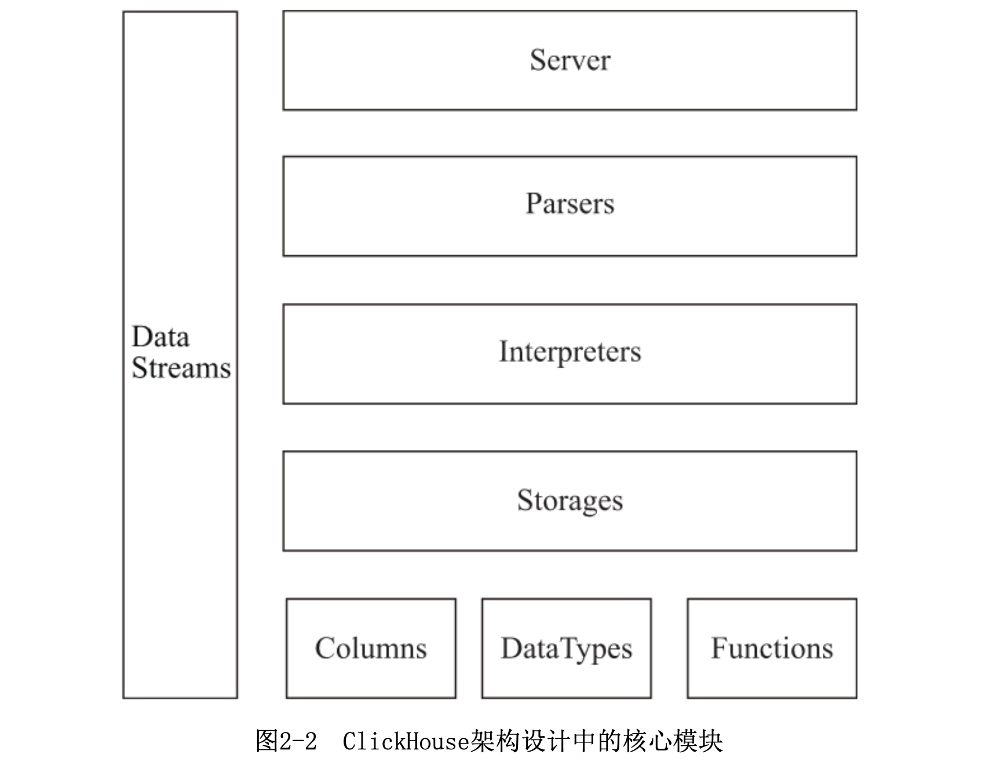
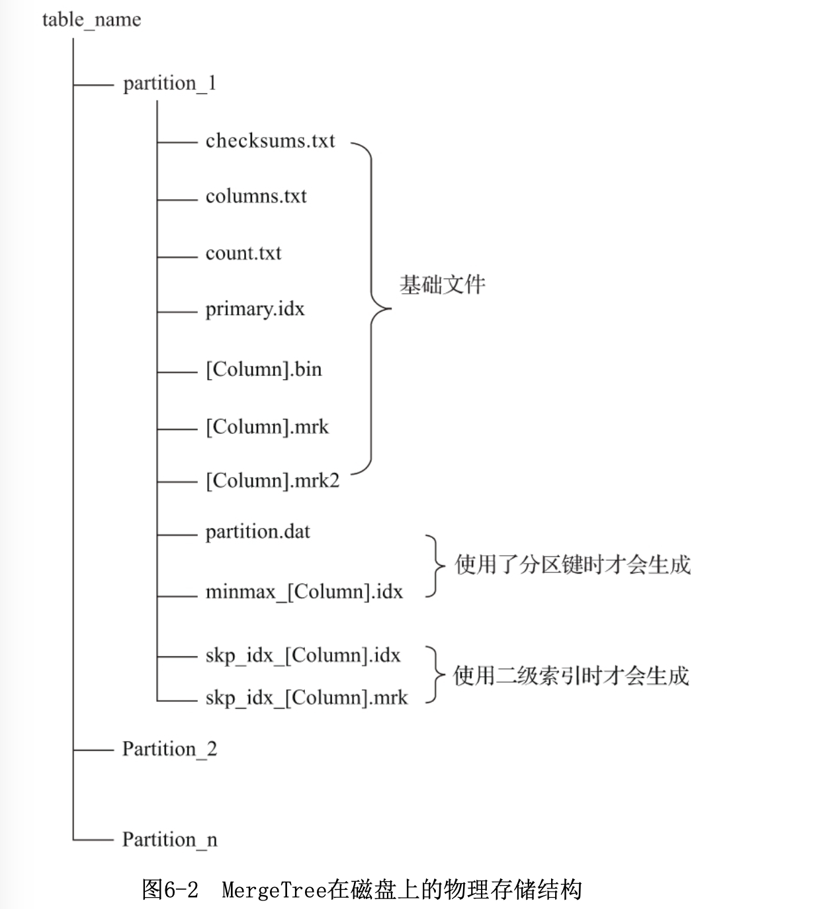
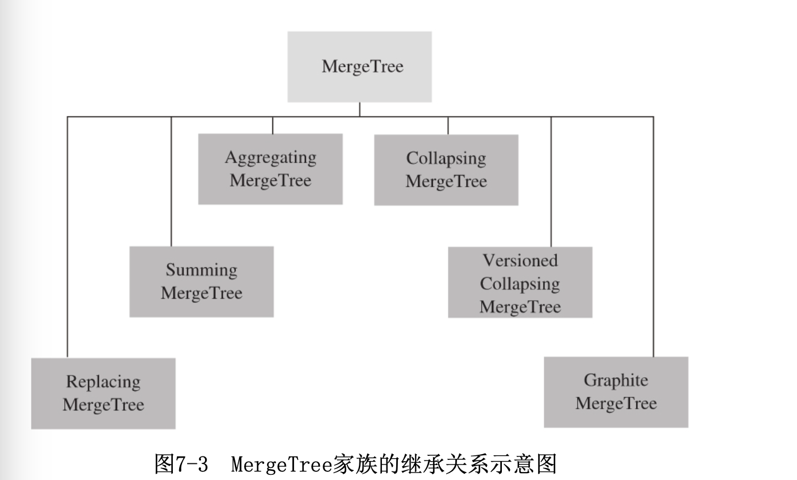
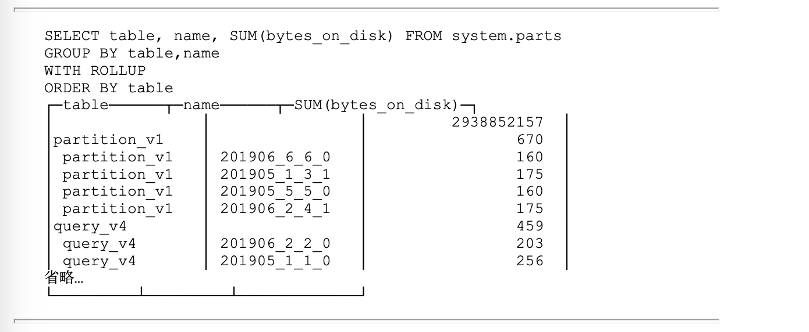

## 第1章 ClickHouse的前世今生

### 1.1 传统BI系统之殇

### 1.2 现代BI系统的新思潮

### 1.3 OLAP常见架构分类

**OLAP名为联机分析，又可以称为多维分析，**是由关系 型数据库之父埃德加·科德(Edgar Frank Codd)于1993年提出的概 念。顾名思义，它指的是通过多种不同的维度审视数据，进行深层次 分析。维度可以看作观察数据的一种视角，例如人类能看到的世界是 三维的，它包含长、宽、高三个维度。直接一点理解，**维度就好比是 一张数据表的字段，而多维分析则是基于这些字段进行聚合查询。**

### 1.4 OLAP实现技术的演进

### 1.5 一匹横空出世的黑马

### 1.6 ClickHouse的发展历程

### 1.7 ClickHouse的名称含义

在采集数据的过程中，一次页面click(点击)，会产生 一个event(事件)。至此，整个系统的逻辑就十分清晰了，那就是基 于页面的点击事件流，面向数据仓库进行OLAP分析。所以ClickHouse 的全称是Click Stream，Data WareHouse，简称ClickHouse

### 1.8 ClickHouse适用的场景

在存储数据超过20万亿行的情况下， ClickHouse做到了90%的查询都能够在1秒内返回的惊人之举。

ClickHouse非常适用于商业智能领域(也就是我们所说的BI领 域)，除此之外，它也能够被广泛应用于广告流量、Web、App流量、 电信、金融、电子商务、信息安全、网络游戏、物联网等众多其他领 域。

### 1.9 ClickHouse不适用的场景

它 有以下几点不足。

·不支持事务。

·不擅长根据主键按行粒度进行查询(虽然支持)，故不应该把 ClickHouse当作Key-Value数据库使用。

·不擅长按行删除数据(虽然支持)。

### 1.10 有谁在使用ClickHouse

### 1.11 本章小结

本章开宗明义，介绍了作为一线从业者的我在经历BI系统从传统 转向现代的过程中的所思所想，以及如何在机缘巧合之下发现了令人 印象深刻的ClickHouse。本章抽丝剥茧，揭开了ClickHouse诞生的缘 由。原来ClickHouse背后的研发团队是来自俄罗斯的Yandex公司， Yandex为了支撑Web流量分析产品Yandex.Metrica，在历经MySQL、 Metrage和OLAPServer三种架构之后，集众家之所长，打造出了 ClickHouse。

## 第2章 ClickHouse架构概述

### 2.1 ClickHouse的核心特性

**ClickHouse是一款MPP架构的列式存储数据库**

ClickHouse拥有完备的管理功能，所以它称得上是一个 DBMS(Database Management System，数据库管理系统)，而不仅是 一个数据库。作为一个DBMS，它具备了一些基本功能，如下所示。

·DDL(数据定义语言):可以动态地创建、修改或删除数据库、 表和视图，而无须重启服务。

·DML(数据操作语言):可以动态查询、插入、修改或删除数 据。

·权限控制:可以按照用户粒度设置数据库或者表的操作权限，保障数据的安全性。

·数据备份与恢复:提供了数据备份导出与导入恢复机制，满足生产环境的要求。

·分布式管理:提供集群模式，能够自动管理多个数据库节点。

**ClickHouse就是一款使用列式存储的数据库**，数据按列进行组 织，属于同一列的数据会被保存在一起，列与列之间也会由不同的文 件分别保存(这里主要指MergeTree表引擎，表引擎会在后续章节详细 介绍)。数据默认使用LZ4算法压缩，在Yandex.Metrica的生产环境 中，数据总体的压缩比可以达到8:1(未压缩前17PB，压缩后2PB)。 列式存储除了降低IO和存储的压力之外，还为向量化执行做好了铺垫。

ClickHouse目前利用SSE4.2指令集实现向量化执行。向量化执行，可以简单地看作一项消除程序中循环的优化。

ClickHouse完全使用SQL作为查询语言(支持GROUP BY、 ORDER BY、JOIN、IN等大部分标准SQL)

ClickHouse共拥有 合并树、内存、文件、接口和其他6大类20多种表引擎。

ClickHouse也大量使用了多线程技术以实 现提速，以此和向量化执行形成互补。

HDFS、Spark、HBase和Elasticsearch这类分布式系统，都采用了 Master-Slave主从架构，由一个管控节点作为Leader统筹全局。而 ClickHouse则采用Multi-Master多主架构，集群中的每个节点角色对 等，客户端访问任意一个节点都能得到相同的效果。

ClickHouse当之无愧地阐释了“在线”二字的含义，即便 是在复杂查询的场景下，它也能够做到极快响应，且无须对数据进行 任何预处理加工。

数据分片是将数据进行横向切分，这是一种在面对海量数据的场 景下，解决存储和查询瓶颈的有效手段，是一种分治思想的体现。 **ClickHouse支持分片**，而分片则依赖集群。每个集群由1到多个分片组 成，而每个分片则对应了ClickHouse的1个服务节点。分片的数量上限 取决于节点数量(1个分片只能对应1个服务节点)。ClickHouse并不像其他分布式系统那样，拥有高度自动化的分片 功能。**ClickHouse提供了本地表(Local Table)与分布式表 (Distributed Table)的概念**。一张本地表等同于一份数据的分片。 而分布式表本身不存储任何数据，它是本地表的访问代理，其作用类 似分库中间件。借助分布式表，能够代理访问多个数据分片，从而实 现分布式查询。

### 2.2 ClickHouse的架构设计



虽然Column和Filed组成了数据的基本映射单元，但对应到 实际操作，它们还缺少了一些必要的信息，比如数据的类型及列的名 称。于是ClickHouse设计了**Block**对象，Block对象可以看作数据表的 子集。Block对象的本质是由数据对象、数据类型和列名称组成的三元 组，即Column、DataType及列名称字符串。

**在数据表的底层设计中并没有所谓的Table对象，它直接使用 IStorage接口指代数据表。**表引擎是ClickHouse的一个显著特性，**不 同的表引擎由不同的子类实现**，例如IStorageSystemOneBlock(系统 表)、StorageMergeTree(合并树表引擎)和StorageTinyLog(日志 表引擎)等。

Parser和Interpreter是非常重要的两组接口:Parser分析器负责 创建AST对象;而Interpreter解释器则负责解释AST，并进一步创建查 询的执行管道。

ClickHouse主要提供两类函数——普通函数和聚合函数。普通函 数由IFunction接口定义，拥有数十种函数实现，例如 FunctionFormatDateTime、FunctionSubstring等。除了一些常见的函 数(诸如四则运算、日期转换等)之外，也不乏一些非常实用的函 数，例如网址提取函数、IP地址脱敏函数等。普通函数是没有状态 的，函数效果作用于每行数据之上。当然，在函数具体执行的过程 中，并不会一行一行地运算，而是采用向量化的方式直接作用于一整 列数据。聚合函数由IAggregateFunction接口定义，**相比无状态的普通函 数，聚合函数是有状态的。**以COUNT聚合函数为例，其 AggregateFunctionCount的状态使用整型UInt64记录。聚合函数的状 态支持序列化与反序列化，所以能够在分布式节点之间进行传输，以 实现增量计算。

### 2.3 ClickHouse为何如此之快

ClickHouse的设计则采用了自下而上 的方式。

针对同一个场景的不同状况，选择使用不同的实现方式，尽可能 将性能最大化。关于这一点，其实在前面介绍字符串查询时，针对不 同场景选择不同算法的思路就有体现了。类似的例子还有很多，例如 去重计数uniqCombined函数，会根据数据量的不同选择不同的算法: 当数据量较小的时候，会选择Array保存;当数据量中等的时候，会选 择HashSet;而当数据量很大的时候，则使用HyperLogLog算法。

ClickHouse的黑魔法并不是一项单一的技术，而是一种自底 向上的、追求极致性能的设计思路。这就是它如此之快的秘诀。

### 2.4 本章小结

本章我们快速浏览了世界第三大Web流量分析平台Yandex.Metrica 背后的支柱ClickHouse的核心特性和逻辑架构。通过对核心特性部分 的展示，ClickHouse如此强悍的缘由已初见端倪，列式存储、向量化 执行引擎和表引擎都是它的撒手锏。在架构设计部分，则进一步展示 了ClickHouse的一些设计思路，例如Column、Field、Block和 Cluster。了解这些设计思路，能够帮助我们更好地理解和使用 ClickHouse。最后又从另外一个角度探讨了ClickHouse如此之快的秘 诀。下一章将介绍如何安装、部署ClickHouse。

## 第3章 安装与部署

### 3.1 Clickhouse的安装过程

ClickHouse支持运行在主流64位CPU架构(X86、AArch和 PowerPC)的Linux操作系统之上，可以通过源码编译、预编译压缩 包、Docker镜像和RPM等多种方法进行安装。由于篇幅有限，本节着重 讲解离线RPM的安装方法。更多的安装方法请参阅官方手册，此处不再 赘述。

### 3.2 客户端的访问接口

ClickHouse的底层访问接口支持TCP和HTTP两种协议，其中，**TCP 协议拥有更好的性能，其默认端口为9000，主要用于集群间的内部通 信及CLI客户端**;而**HTTP协议则拥有更好的兼容性，**可以通过REST服务 的形式被广泛用于JAVA、Python等编程语言的客户端，其默认端口为 8123。通常而言，并不建议用户直接使用底层接口访问ClickHouse， 更为推荐的方式是通过CLI和JDBC这些封装接口，因为它们更加简单易 用。

CLI(Command Line Interface)即命令行接口，其底层是基于TCP接口进行通信 的，是通过clickhouse-client脚本运行的。它拥有两种执行模式。

交互式执行

非交互式执行

ClickHouse支持标准的JDBC协议，底层基于HTTP接口通信。使用下面的Maven依赖，即可 为Java程序引入官方提供的数据库驱动包

### 3.3 内置的实用工具

ClickHouse除了提供基础的服务端与客户端程序之外，还内置了 clickhouse-local和clickhouse-benchmark两种实用工具

clickhouse-local可以独立运行大部分SQL查询，不需要依赖任何 ClickHouse的服务端程序，它可以理解成是ClickHouse服务的单机版微内 核，是一个轻量级的应用程序。

clickhouse-benchmark是基准测试的小工具，它可以自动运行SQL查询，并生成相应的运行指标报 告

### 3.4 本章小结

本章首先介绍了基于离线RPM包安装ClickHouse的整个过程。接着 介绍了ClickHouse的两种访问接口，其中TCP端口拥有更好的访问性 能，而HTTP端口则拥有更好的兼容性。但是在日常应用的过程中，更 推荐使用基于它们之上实现的封装接口。所以接下来，我们又分别介 绍了两个典型的封装接口，其中CLI接口是基于TCP封装的，它拥有交 互式和非交互式两种运行模式。而JDBC接口是基于HTTP封装的，是一 种标准的数据库访问接口。最后介绍了ClickHouse内置的几种实用工 具。从下一章开始将正式介绍ClickHouse的功能，首先会从数据定义 开始。

## 第4章 数据定义

ClickHouse支持较完备的DML语 句，包括INSERT、SELECT、UPDATE和DELETE。虽然UPDATE和DELETE可 能存在性能问题，但这些能力的提供确实丰富了各位架构师手中的筹 码，在架构设计时也能多几个选择。

作为一款完备的DBMS(数据库管理系统)，ClickHouse提供了DDL 与DML的功能，并支持大部分标准的SQL。

### 4.1 ClickHouse的数据类型

基础类型只有数值、字符串和时间三种类型**，没有Boolean类型， 但可以使用整型的0或1替代。**

字符串类型分为String、FixedString、UUID（数据库常见的主键类型）

时间类型分为DateTime、DateTime64、Date

符合类型包括Array（可以定义为array(T)或者[T]，需要明确数据类型）

Tuple：元组，由1-n个元素组成，每个元素允许设置不同的数据类型，且彼此之间不要求兼容。使用tuple(T)比如tuple(1,'a',now())或者T比如(1,2,null,'a')

Enum：包括Enum8和Enum16。

Nested：嵌套类型，类似go的 struct，比如：

```sql
CREATE TABLE nested_test {
	name String,
	age UInt8,
	dept Nested{
		id UInt8,
		name String
	}
}Engine = Memory;
```

此外还有一些特殊类型：

Nullable：表示某个基础数据类型可以是Null值。

Domain：域名类型可以分为IPv4和IPv6类型。IPv4是基于UInt32封装的。

### 4.2 如何定义数据表

数据表一共支持如下5种类型：

Ordinary：默认引擎，在此数据库下可以使用任意类型的表引擎。

Dictionary：字典引擎，此类数据库会自动为所有数据字典创建它们的数据表

Memory：内存引擎，用于存放临时数据。此类数据库下的数据表只会存放在内存中，不会涉及到任何磁盘操作，当服务器重启时数据会被清除。

Lazy：日志引擎，此类数据库下只能使用Log系列的表引擎。

MySQL：MySQL引擎，此类数据库下会自动拉取远端MySQL下的数据，并为它们创建MySQL表引擎的数据表。

clickhouse数据表的定义语法，是在标准SQL的基础上建立的。

使用[db_name.]参数可以为数据表指定数据库，如果不指定此参数，则默认会使用default数据库。建表语句参考：

```sql
CREATE TABLE [IF NOT EXISTS] [db_name].table_name (
	name1 [type] [DEFAULT|MATERIALIZED|ALAS expr|,
	...
)
```

建表可以把其他表结构复制过去，并且新表ENGINE表引擎可以和原表不同，参考：

```sql
CREATE TABLE IF NOT EXISTS new_db.hots_v1 AS default.hit_v1 ENGINE=TinyLog
```

创建表的时候某个字段的值可以设置默认值为另一个字段的值，比如：

 ```shell
 CREATE TABLE dfv_v1 (
 	id String,
 	c1 DEFAULT 1000,
 	c2 String DEFAULT c1
 ) ENGINE = TinyLog
 ```

使用ALTER修改字段默认值的时候并不会影响表内先前存在的数据。

clickhouse也有临时表的概念，临时表有以下特殊之处：

它的生命周期是会话绑定的，所以只支持Memory表引擎。

临时表不属于任何数据库，所以它的建表语句中，即没有数据库参数也没有表引擎参数。

临时表的优先级大于普通表。

假设数据表按照月份分区，那么数据就可以按照月份的粒度被替换更新。目前只有合并树（MergeTree）家族系列的表引擎才支持数据分区。可以用PARTITION BY指定分区键。

clickhouse拥有普通和物化两种视图，其中物化试图拥有独立的存储，而普通视图只是一层简单的查询代理，创建普通视图的完整语法如下：

```sql
CREATE VIEW [IF NOT EXISTS] [db_name.]view_name AS SELECT ...
```

### 4.3 数据库的基本操作

如果修改某个字段的数据类型，实质上会调用相应的toType转型方法，如果当前的类型和期望的类型不能兼容，那么修改操作会失败。

### 4.4 数据库的基本操作

### 4.5 分布式DDL执行

将一条普通的DDL语句转换成分布式执行非常简单，只需要加上ON CLUSTER cluster_name声明即可。

### 4.6 数据的写入

### 4.7 数据的删除与修改

clickhouse提供了DELETE和UPDATE的能力，这类操作被称为Mutation查询，它可以看作ALTER语句的变种。DELETE操作是一个异步的后台执行动作。

### 4.8 本章小结

通过对本章的学习，我们知道了ClickHouse的数据类型是由基础 类型、复合类型和特殊类型组成的。基础类型相比常规数据库显得精 简干练;复合类型很实用，常规数据库通常不具备这些类型;而特殊 类型的使用场景较少。同时我们也掌握了数据库、数据表、临时表、 分区表和视图的基本操作以及对元数据和分区的基本操作。最后我们 还了解到在ClickHouse中如何写入、修改和删除数据。本章的内容为 介绍后续知识点打下了坚实的基础。下一章我们将介绍数据字典。

## 第5章 数据字典

数据字典是ClickHouse提供的一种非常简单、实用的存储媒介， 它以键值和属性映射的形式定义数据。

### 5.1 内置字典

ClickHouse目前只有一种内置字典——Yandex.Metrica字典。从 名称上可以看出，这是用在ClickHouse自家产品上的字典，而它的设 计意图是快速存取geo地理数据。但较为遗憾的是，由于版权原因 Yandex并没有将geo地理数据开放出来。这意味着ClickHouse目前的内 置字典，只是提供了字典的定义机制和取数函数，而没有内置任何现 成的数据。所以内置字典的现状较为尴尬，需要遵照它的字典规范自 行导入数据。

### 5.2 外部扩展字典

外部扩展字典是以插件形式注册到ClickHouse中的，由用户自行 定义数据模式及数据来源。

### 5.3 本章小结

通过对本章的学习，我们知道了ClickHouse拥有内置与扩展两类 数据字典，同时也掌握了数据字典的配置、更新和查询的基本操作。 在内置字典方面，目前只有一种YM字典且需要自行准备数据，而扩展 字典是更加常用的字典类型。在扩展字典方面，目前拥有7种类型，其 中flat、hashed和range_hashed依次拥有最高的性能。数据字典能够 有效地帮助我们消除不必要的JOIN操作(例如根据ID转名称)，优化 SQL查询，为查询性能带来质的提升。下一章将开始介绍MergeTree表 引擎的核心原理。

## 第6章 MergeTree原理解析

ClickHouse拥有非常庞大的表引 擎体系，截至本书完成时，其共拥有合并树、外部存储、内存、文 件、接口和其他6大类20多种表引擎。

只有合 并树系列的表引擎才支持主键索引、数据分区、数据副本和数据采样 这些特性，同时也只有此系列的表引擎支持ALTER相关操作。

### 6.1 MergeTree的创建方式与存储结构

MergeTree在写入一批数据时，数据总会以数据片段的形式写入磁 盘，且数据片段不可修改。为了避免片段过多，ClickHouse会通过后 台线程，定期合并这些数据片段，属于相同分区的数据片段会被合成 一个新的片段。这种数据片段往复合并的特点，也正是合并树名称的 由来。

创建MergeTree时可以指定参数SETTINGS，SETTINGS:index_granularity [选填]: index_granularity对于MergeTree而言是一项非常重要的参数，它表 示索引的粒度，默认值为8192。也就是说，MergeTree的索引在默认情 况下，每间隔8192行数据才生成一条索引

MergeTree表引擎中的数据是拥有物理存储的，数据会按照分区目 录的形式保存到磁盘之上



### 6.2 数据分区

MergeTree伴随着每一批数据的写入(一次INSERT语句)， MergeTree都会生成一批新的分区目录。

### 6.3 一级索引

MergeTree的主键使用PRIMARY KEY定义，待主键定义之后， MergeTree会依据index_granularity间隔(默认8192行)，为数据表 生成一级索引并保存至primary.idx文件内，索引数据按照PRIMARY KEY排序。相比使用PRIMARY KEY定义，更为常见的简化形式是通过 ORDER BY指代主键。在此种情形下，PRIMARY KEY与ORDER BY定义相 同，所以索引(primary.idx)和数据(.bin)会按照完全相同的规则 排序。对于PRIMARY KEY与ORDER BY定义有差异的应用场景在 SummingMergeTree引擎章节部分会所有介绍，而关于数据文件的更多 细节，则留在稍后的6.5节介绍，本节重点讲解一级索引部分。

在稠密索引中每一行索引标记都会对应到一行具体的 数据记录。而在稀疏索引中，每一行索引标记对应的是一段数据，而 不是一行。

### 6.4 二级索引

除了一级索引之外，MergeTree同样支持二级索引。二级索引又称 跳数索引，由数据的聚合信息构建而成。根据索引类型的不同，其聚 合信息的内容也不同。跳数索引的目的与一级索引一样，也是帮助查 询时减少数据扫描的范围。

MergeTree共支持4种跳数索引，分别是minmax、set、 ngrambf_v1和tokenbf_v1。一张数据表支持同时声明多个跳数索引。

### 6.5 数据存储

在MergeTree中，数据按列存储。而具体到每个列字段，数据也是 独立存储的，每个列字段都拥有一个与之对应的.bin数据文件。也正 是这些.bin文件，最终承载着数据的物理存储。数据文件以分区目录 的形式被组织存放，所以在.bin文件中只会保存当前分区片段内的这 一部分数据，其具体组织形式已经在图6-2中展示过。按列独立存储的 设计优势显而易见:一是可以更好地进行数据压缩(相同类型的数据 放在一起，对压缩更加友好)，二是能够最小化数据扫描的范围。

一个.bin文件是由1至多个压缩数据块组成的，每 个压缩块大小在64KB~1MB之间。多个压缩数据块之间，按照写入顺序首尾相接，紧 密地排列在一起

### 6.6 数据标记

如果把MergeTree比作一本书，primary.idx一级索引好比这本书 的一级章节目录，.bin文件中的数据好比这本书中的文字，那么数据 标记(.mrk)会为一级章节目录和具体的文字之间建立关联。对于数据 标记而言，它记录了两点重要信息:其一，是一级章节对应的页码信 息;其二，是一段文字在某一页中的起始位置信息。这样一来，通过 数据标记就能够很快地从一本书中立即翻到关注内容所在的那一页， 并知道从第几行开始阅读。

读取压缩数据块: 在查询某一列数据时，MergeTree无须一 次性加载整个.bin文件，而是可以根据需要，只加载特定的压缩数据 块。而这项特性需要借助标记文件中所保存的压缩文件中的偏移量。

读取数据: 在读取解压后的数据时，MergeTree并不需要一 次性扫描整段解压数据，它可以根据需要，以index_granularity的粒 度加载特定的一小段。为了实现这项特性，需要借助标记文件中保存 的解压数据块中的偏移量。

### 6.7 对于分区、索引、标记和压缩数据的协同总结

分区、索引、标记和压缩数据，就好比是MergeTree给出的一套组 合拳，使用恰当时威力无穷。那么，在依次介绍了各自的特点之后， 现在将它们聚在一块进行一番总结。接下来，就分别从写入过程、查 询过程，以及数据标记与压缩数据块的三种对应关系的角度展开介 绍。

数据查询的本质，可以看作一个不断减小数据范围的过程。在最 理想的情况下，MergeTree首先可以依次借助分区索引、一级索引和二 级索引，将数据扫描范围缩至最小。然后再借助数据标记，将需要解 压与计算的数据范围缩至最小。

### 6.8 本章小结

本章全方面、立体地解读了MergeTree表引擎的工作原理:首先， 解释了MergeTree的基础属性和物理存储结构;接着，依次介绍了数据 分区、一级索引、二级索引、数据存储和数据标记的重要特性;最 后，结合实际样例数据，进一步总结了MergeTree上述特性在一起协同 时的工作过程。掌握本章的内容，即掌握了合并树系列表引擎的精 髓。下一章将进一步介绍MergeTree家族中其他常见表引擎的具体使用 方法。

## 第7章 MergeTree系列表引擎

目前在ClickHouse中，按照特点可以将表引擎大致分成6个系列， 分别是合并树、外部存储、内存、文件、接口和其他，每一个系列的 表引擎都有着独自的特点与使用场景。在它们之中，最为核心的当属 MergeTree系列，因为它们拥有最为强大的性能和最广泛的使用场合。

经过上一章的介绍，大家应该已经知道了MergeTree有两层含义: 其一，表示合并树表引擎家族;其二，表示合并树家族中最基础的 MergeTree表引擎。而在整个家族中，除了基础表引擎MergeTree之 外，常用的表引擎还有ReplacingMergeTree、SummingMergeTree、 AggregatingMergeTree、CollapsingMergeTree和 VersionedCollapsingMergeTree。每一种合并树的变种，在继承了基 础MergeTree的能力之后，又增加了独有的特性。其名称中的“合并” 二字奠定了所有类型MergeTree的基因，它们的所有特殊逻辑，都是在 触发合并的过程中被激活的。在本章后续的内容中，会逐一介绍它们 的特点以及使用方法。

### 7.1 MergeTree

MergeTree作为家族系列最基础的表引擎，提供了数据分区、一级 索引和二级索引等功能。对于它们的运行机理，在上一章中已经进行 了详细介绍。本节将进一步介绍MergeTree家族独有的另外两项能力 ——数据TTL与存储策略。

TTL即Time To Live，顾名思义，它表示数据的存活时间。

再次查询ttl_table_v1则能够看到，由于第一行数据满足TTL过期条件(当前系统时间 >=create_time+10秒)，它们的code和type列会被还原为数据类型的默认值

### 7.2 ReplacingMergeTree

虽然MergeTree拥有主键，但是它的主键却没有唯一键的约束。这 意味着即便多行数据的主键相同，它们还是能够被正常写入。在某些 使用场合，用户并不希望数据表中含有重复的数据。

注意这里的ORDER BY是去除重复数据的关键，排序键ORDER BY所 声明的表达式是后续作为判断数据是否重复的依据。在这个例子中， 数据会基于id和code两个字段去重。

### 7.3 SummingMergeTree

如果需要同时定义ORDER BY与PRIMARY KEY，通常只有一种可能， 那便是明确希望ORDER BY与PRIMARY KEY不同。这种情况通常只会在使 用SummingMergeTree或AggregatingMergeTree时才会出现。

如果同时声明了ORDER BY与PRIMARY KEY，MergeTree会强制要求 PRIMARY KEY列字段必须是ORDER BY的前缀。比如：

```sql
ORDER BY (B、C)
PRIMARY KEY B
```

这里的ORDER BY是一项关键配置，SummingMergeTree在进行 数据汇总时，会根据ORDER BY表达式的取值进行聚合操作。

在第一个分区内，同为A001:wuhan的两条数据汇总 成了一行。其中，v1和v2被SUM汇总，不在汇总字段之列的create_time 则选取了同组内第一行数据的取值。

### 7.4 AggregatingMergeTree

有过数据仓库建设经验的读者一定知道“数据立方体”的概念，这是一个在数据仓库领域十分常见的模型。它通过以空间换时间的方法提升查询性能，将需要聚合的数据预先计算出来，并将结果保存起来。在后续进行聚合查询的时候，直接使用结果数据。

AggregatingMergeTree更为常见的应用方式是结合物化视图使用，将它作为物化视 图的表引擎。而这里的物化视图是作为其他数据表上层的一种查询视图，

### 7.5 CollapsingMergeTree

对于ClickHouse这类高性能分析型数据 库而言，对数据源文件修改是一件非常奢侈且代价高昂的操作。相较于直 接修改源文件，它们会将修改和删除操作转换成新增操作，即以增代删。

### 7.6 VersionedCollapsingMergeTree

### 7.7 各种MergeTree之间的关系总结

我们可以使用继承和组合这两种关系来理解整个MergeTree。



在具体的实现逻辑部分，7种MergeTree共用一个主 体，在触发Merge动作时，它们调用了各自独有的合并逻辑。

### 7.8 本章小结

本章全面介绍了MergeTree表引擎系列，通过本章我们知道了，合 并树家族除了基础表引擎MergeTree之外，还有另外5种常用的变种来 引擎。对于MergeTree而言，继上一章介绍了它的核心工作原理之后， 本章又进一步介绍了它的TTL机制和多数据块存储。除此之外，我们还 知道了MergeTree各个变种表引擎的特点和使用方法，包括支持数据去 重的ReplacingMergeTree、支持预先聚合计算的SummingMergeTree与 AggregatingMergeTree，以及支持数据更新且能够折叠数据的 CollapsingMergeTree与VersionedCollapsingMergeTree。这些 MergeTree系列的表引擎，都用ORDER BY作为条件Key，在分区合并时 触发各自的处理逻辑。下一章将进一步介绍其他常见表引擎的具体使 用方法。

## 第8章 其他常见类型表引擎

本章将继续介绍其他常见类型的表引擎，它们以表作为接口，极 大地丰富了ClickHouse的查询能力。这些表引擎各自特点突出，或是 独立地应用于特定场景，或是能够与MergeTree一起搭配使用。例如， 外部存储系列的表引擎，能够直接读取其他系统的数据，ClickHouse 自身只负责元数据管理，类似使用外挂表的形式;内存系列的表引 擎，能够充当数据分发的临时存储载体或消息通道;日志文件系列的 表引擎，拥有简单易用的特点;接口系列表引擎，能够串联已有的数 据表，起到黏合剂的作用。在本章后续的内容中，会按照表引擎的分 类逐个进行介绍，包括它们的特点和使用方法。

### 		8.1 外部存储类型

顾名思义，外部存储表引擎直接从其他的存储系统读取数据，例 如直接读取HDFS的文件或者MySQL数据库的表。这些表引擎只负责元数 据管理和数据查询，而它们自身通常并不负责数据的写入，数据文件 直接由外部系统提供。

HDFS是一款分布式文件系统，堪称Hadoop生态的基石，

MySQL表引擎可以与MySQL数据库中的数据表建立映射，并通过SQL向其发起远程查询，包括 SELECT和INSERT，它的声明方式如下:

```sql
ENGINE = MySQL('host:port', 'database', 'table', 'user', 'password'[, replace_query, 'on_duplicate_clause'])
```

File表引擎能够直接读取本地文件的数据，通常被作为一种扩充手段 来使用。

即便是手动创建的表目录和数据文件，仍然可以对数据表插入数据，

### 8.2 内存类型

接下来将要介绍的几款表引擎，都是面向内存查询的，数据会从 内存中被直接访问，所以它们被归纳为内存类型。

Memory表引擎直接将数据保存在内存中，数据既不会被压缩也不 会被格式转换，数据在内存中保存的形态与查询时看到的如出一辙。 正因为如此，当ClickHouse服务重启的时候，Memory表内的数据会全 部丢失。所以在一些场合，会将Memory作为测试表使用，很多初学者 在学习ClickHouse的时候所写的Hello World程序很可能用的就是 Memory表。由于不需要磁盘读取、序列化以及反序列等操作，所以 Memory表引擎支持并行查询，并且在简单的查询场景中能够达到与 MergeTree旗鼓相当的查询性能(一亿行数据量以内)。

Memory表更为广 泛的应用场景是在ClickHouse的内部，它会作为集群间分发数据的存 储载体来使用。例如在分布式IN查询的场合中，会利用Memory临时表 保存IN子句的查询结果，并通过网络将它传输到远端节点。

Buffer表引擎完全使用内存装载数据，不支持文件的持久化存储，所以当服务重启之后，表内的 数据会被清空。Buffer表引擎不是为了面向查询场景而设计的，它的作用是充当缓冲区的角色。假设 有这样一种场景，我们需要将数据写入目标MergeTree表A，由于写入的并发数很高，这可能会导致 MergeTree表A的合并速度慢于写入速度(因为每一次INSERT都会生成一个新的分区目录)。此时，可 以引入Buffer表来缓解这类问题，**将Buffer表作为数据写入的缓冲区。数据首先被写入Buffer表，当 满足预设条件时，Buffer表会自动将数据刷新到目标表**

### 8.3 日志类型

TinyLog是日志家族系列中性能最低的表引擎，它的存储结构由数 据文件和元数据两部分组成。其中，数据文件是按列独立存储的，也 就是说每一个列字段都拥有一个与之对应的.bin文件。这种结构和 MergeTree有些相似，但是TinyLog既不支持分区，也没有.mrk标记文 件。由于没有标记文件，它自然无法支持.bin文件的并行读取操作， 所以它只适合在非常简单的场景下使用。

由于拥有数据标记且各列数据独立存储，所以Log既能够支持 并行查询，又能够按列按需读取，

### 8.4 接口类型

有这么一类表引擎，它们自身并不存储任何数据，而是像黏合剂一样可以整合其他的数据表。在使用这类表引擎的时候，不用担心底层的复杂性，它们就像接口一样，为用户提供了统一的访问界面，所以我将它们归为接口类表引擎。

被代理查询的数据表被要求处于同一个数据库内，且拥有相同的 表结构，但是它们可以使用不同的表引擎以及不同的分区定义(对于 MergeTree而言)。

Dictionary表引擎是数据字典的一层代理封装，它可以取代字典函数，让用户 通过数据表查询字典。字典内的数据被加载后，会全部保存到内存中，所以使用 Dictionary表对字典性能不会有任何影响。声明Dictionary表的方式如下所示:

```
 ENGINE = Dictionary(dict_name)
```

其中，dict_name对应一个已被加载的字典名称，例如下面的例子:

```
  CREATE TABLE tb_test_flat_dict (
       id UInt64,
code String,
       name String
   )Engine = Dictionary(test_flat_dict);
```

tb_test_flat_dict等同于数据字典test_flat_dict的代理表

在数据库领域，当面对海量业务数据的时候，一种主流的做法是 实施Sharding方案，即将一张数据表横向扩展到多个数据库实例。其 中，每个数据库实例称为一个Shard分片，数据在写入时，需要按照预 定的业务规则均匀地写至各个Shard分片;而在数据查询时，则需要在 每个Shard分片上分别查询，最后归并结果集。

### 8.5 其他类型

Live View是一种特殊的视图，虽然它并不属于表引擎，但是因为 它与数据表息息相关，所以我还是把Live View归类到了这里

Null表引擎的功能与作用，与Unix系统的空设备/dev/null很相 似。如果用户向Null表写入数据，系统会正确返回，但是Null表会自 动忽略数据，永远不会将它们保存。如果用户向Null表发起查询，那 么它将返回一张空表。

### 8.6 本章小结

本章全面介绍了除第7章介绍的表引擎之外的其他类型的表引擎， 知道了MergeTree家族表引擎之外还有另外5类表引擎。这些表引擎丰 富了ClickHouse的使用场景，扩充了ClickHouse的能力界限。

外部存储类型的表引擎与Hive的外挂表很相似，它们只负责元数 据管理和数据查询，自身并不负责数据的生成，数据文件直接由外部 系统维护。它们可以直接读取HDFS、本地文件、常见关系型数据库和 KafKa的数据。

内存类型的表引擎中的数据是常驻内存的，所以它们拥有堪比 MergeTree的查询性能(1亿数据量以内)。其中Set和Join表引擎拥有 物理存储，数据在写入内存的同时也会被刷新到磁盘;而Memory和 Buffer表引擎在服务重启之后，数据便会被清空。内存类表引擎是一 把双刃剑，在数据大于1亿的场景下不建议使用内存类表引擎。

日志类型表引擎适用于数据量在100万以下，并且是“一次”写入 多次查询的场景。其中TinyLog、StripeLog和Log的性能依次升高的。

接口类型的表引擎自身并不存储任何数据，而是像黏合剂一样可 以整合其他的数据表。其中Merge表引擎能够合并查询任意张表结构相 同的数据表;Dictionary表引擎能够代理查询数据字典;而 Distributed表引擎的作用类似分布式数据库的分表中间件，能够帮助 用户简化数据的分发和路由工作。

其他类型的表引擎用途迥异。其中Live View是一种特殊的视图， 能够对SQL查询进行准实时监听;Null表引擎类似于Unix系统的空设 备/dev/null，通常与物化视图搭配使用;而URL表引擎类似于HTTP客 户端，能够代理调用远端的REST服务。

## 第9章 数据查询

ClickHouse完全使用SQL作为查询语言，能够以 SELECT查询语句的形式从数据库中选取数据，

例如在绝大部分场景中，都应该避免使用SELECT * 形式来查询数据，因为通配符*对于采用列式存储的ClickHouse而言没有任何好处。假如面对一张拥有数 百个列字段的数据表，下面这两条SELECT语句的性能可能会相差100倍之多:

```sql
SELECT * FROM datasets.hits_v1;
SELECT WatchID FROM datasets.hits_v1;
```

### 9.1 WITH子句

### 9.2 FROM子句

FROM子句表示从何处读取数据，目前支持如下3种形式。 (1)从数据表中取数:

```
   SELECT WatchID FROM hits_v1
```

(2)从子查询中取数:

```
   SELECT MAX_WatchID
   FROM (SELECT MAX(WatchID) AS MAX_WatchID FROM hits_v1)
```

(3)从表函数中取数:

```
   SELECT number FROM numbers(5)
```

### 9.3 SAMPLE子句

SAMPLE子句能够实现数据采样的功能，使查询仅返回采样数据而不是全部数据， 从而有效减少查询负载。

### 9.4 ARRAY JOIN子句

ARRAY JOIN子句允许在数据表的内部，与数组或嵌套类型的字段进行JOIN操作，从而将一行数组展开 为多行。

### 9.5 JOIN子句

JOIN子句可以对左右两张表的数据进行连接，这是最常用的查询 子句之一。它的语法包含连接精度和连接类型两部分。

OUTER JOIN表示外连接，它可以进一步细分为左外连接 (LEFT)、右外连接(RIGHT)和全外连接(FULL)三种形式。

CROSS JOIN表示交叉连接，它会返回左表与右表两个数据集合的 笛卡儿积。也正因为如此，CROSS JOIN不需要声明JOIN KEY，因为结 果会包含它们的所有组合

为了能够优化JOIN查询性能，首先应该遵循左大右小的原则 ，即 将数据量小的表放在右侧。

### 9.7 GROUP BY子句

GROUP BY又称聚合查询，是最常用的子句之一，它是让 ClickHouse最凸显卓越性能的地方。在GROUP BY后声明的表达式，通 常称为聚合键或者Key，数据会按照聚合键进行聚合。在ClickHouse的 聚合查询中，SELECT可以声明聚合函数和列字段，如果SELECT后只声 明了聚合函数，则可以省略GROUP BY关键字:

```sql
SELECT SUM(data_compressed_bytes) AS compressed , 
SUM(data_uncompressed_bytes) AS uncompressed
FROM system.parts
```

在某些场合下，可以借助any、max和min等聚合函数访问聚合 键之外的列字段

ROLLUP能够按照聚合键从右向左上卷数据，基于聚合 函数依次生成分组小计和总计。如果设聚合键的个数为n，则最终会生 成小计的个数为n+1。例如执行下面的语句:



可以看到在最终返回的结果中，附加返回了显示名称为空的小计 汇总行，包括所有表分区磁盘大小的汇总合计以及每张table内所有分 区大小的合计信息。

### 9.8 HAVING子句

HAVING子句需要与GROUP BY同时出现，不能单独使用。它能够在 聚合计算之后实现二次过滤数据。例如下面的语句是一条普通的聚合 查询，会按照table分组并计数:

```sql
SELECT COUNT() FROM system.parts GROUP BY table 
--执行计划
Expression
       Expression
           Aggregating
               Concat
                   Expression
											One
```

现在增加HAVING子句后再次执行上述操作，则数据在按照table聚 合之后，进一步截掉了table='query_v3'的部分。

```sql
SELECT COUNT() FROM system.parts GROUP BY table HAVING table = 'query_v3' 
--执行计划
Expression
       Expression
           Filter
               Aggregating
                   Concat
                       Expression
                           One
```

观察两次查询的执行计划，可以发现HAVING的本质是在聚合之后 增加了Filter过滤动作。

假设现在需要按照table分组聚 合，并且返回均值bytes_on_disk大于10 000字节的数据表，在这种情 形下需要使用HAVING子句:

```sql
 SELECT table ,avg(bytes_on_disk) as avg_bytes
   FROM system.parts GROUP BY table
   HAVING avg_bytes > 10000
┌─table─────┬───avg_bytes───┐
│ hits_v1       │730190752 │
└─────────┴────────────┘
```

这是因为WHERE的执行优先级大于GROUP BY，所以如果需要按照聚 合值进行过滤，就必须借助HAVING实现。

### 9.9 ORDER BY子句

对于数据中NULL值的排序，目前ClickHouse拥有NULL值最后和 NULL值优先两种策略，可以通过NULLS修饰符进行设置:

NULLS LAST

NULL值排在最后，这也是默认行为，修饰符可以省略。在这种情 形下，数据的排列顺序为其他值(value)→NaN→NULL。

```sql
-- 顺序是value -> NaN -> NULL
WITH arrayJoin([30,null,60.5,0/0,1/0,-1/0,30,null,0/0]) AS v1 SELECT v1 ORDER BY v1 DESC NULLS LAST
┌───v1─┐
│ inf │
│ 60.5 │
│ 30 │
│    30  │
│  -inf  │
│   nan  │
│   nan  │
│  NULL  │
│  NULL  │
└─────┘
```

NULLS FIRST

NULL值排在最前，在这种情形下，数据的排列顺序为NULL→NaN→ 其他值(value)

### 9.10 LIMIT BY子句

LIMIT BY子句和大家常见的LIMIT所有不同，它运行于ORDER BY之 后和LIMIT之前，能够按照指定分组，最多返回前n行数据(如果数据 少于n行，则按实际数量返回)，常用于TOP N的查询场景。LIMIT BY 的常规语法如下:

```
  LIMIT n BY express
```

例如执行下面的语句后便能够在基于数据库和数据表分组的情况 下，查询返回数据占磁盘空间最大的前3张表:


### 9.11 LIMIT子句

```
 SELECT database,table,MAX(bytes_on_disk) AS bytes FROM system.parts
   GROUP BY database,table ORDER BY bytes DESC
   LIMIT 3 BY database
   LIMIT 10
```

上述语句表示，查询返回数据占磁盘空间最大的前3张表，而返回 的总数据行等于10。

### 9.12 SELECT子句

SELECT子句决定了一次查询语句最终返回哪些列字段或表达式。 与直观的感受不同，虽然SELECT位于SQL语句的起始位置，但它却是在 上述一众子句之后执行的。在其他子句执行之后，SELECT会将选取的 字段或表达式作用于每行数据之上。如果使用*通配符，则会返回数据 表的所有字段。正如本章开篇所言，在大多数情况下都不建议这么 做，因为对于一款列式存储的数据库而言，这绝对是劣势而不是优 势。

### 9.13 DISTINCT子句

DISTINCT子句能够去除重复数据，使用场景广泛。有时候，人们 会拿它与GROUP BY子句进行比较。

### 9.14 UNION ALL子句

UNION ALL子句能够联合左右两边的两组子查询，将结果一并返 回。

列字段的名称可以不同，查询结果中的列名会以左边 的子查询为准。

### 9.15 查看SQL执行计划

通过将ClickHouse服务日志设置到DEBUG或者TRACE级别，可以变相实现EXPLAIN查询，以分析 SQL的执行日志。

### 9.16 本章小结

本章按照ClickHouse对SQL大致的解析顺序，依次介绍了各种查询 子句的用法。包括用于简化SQL写法的WITH子句、用于数据采样的 SAMPLE子句、能够优化查询的PREWHERE子句以及常用的JOIN和GROUP BY子句等。但是到目前为止，我们还是只介绍了ClickHouse的本地查 询部分，当面对海量数据的时候，单节点服务是不足以支撑的，所以 下一章将进一步介绍与ClickHouse分布式相关的知识。

## 第10章 副本与分片

纵使单节点性能再强，也会有遇到瓶颈的那一天。业务量的持续 增长、服务器的意外故障，都是ClickHouse需要面对的洪水猛兽。常 言道，“一个篱笆三个桩，一个好汉三个帮”，而集群、副本与分 片，就是ClickHouse的三个“桩”和三个“帮手”。

### 10.1 概述

集群是副本和分片的基础，它将ClickHouse的服务拓扑由单节点 延伸到多个节点，但它并不像Hadoop生态的某些系统那样，要求所有 节点组成一个单一的大集群。ClickHouse的集群配置非常灵活，用户 既可以将所有节点组成一个单一集群，也可以按照业务的诉求，把节 点划分为多个小的集群。在每个小的集群区域之间，它们的节点、分 区和副本数量可以各不相同

副本和分片这对双胞胎兄弟，有时候看起来泾渭分明，有时候又 让人分辨不清。这里有两种区分的方法。一种是从数据层面区分，假 设ClickHouse的N个节点组成了一个集群，在集群的各个节点上，都有 一张结构相同的数据表Y。如果N1的Y和N2的Y中的数据完全不同，则N1 和N2互为分片;如果它们的数据完全相同，则它们互为副本。换言 之，分片之间的数据是不同的，而副本之间的数据是完全相同的。所 以抛开表引擎的不同，单纯从数据层面来看，副本和分片有时候只有 一线之隔。

另一种是从功能作用层面区分，使用副本的主要目的是防止数据 丢失，增加数据存储的冗余;而使用分片的主要目的是实现数据的水 平切分

### 10.2 数据副本

用ReplicatedMergeTree的数据表就是副 本。

正如前文所言，使用副本的好处甚多。首先，由于增加了数据的冗余存储，所以降低了数据丢失的风险;其次，由于副本采用了多主架构，所以每个副本实例都可以作为数据读、写的入口，这无疑分摊了节点的负载。

在使用副本时，不需要依赖任何集群配置(关于集群配置，在后 续小节会详细介绍)ReplicatedMergeTree结合ZooKeeper就能完成 全部工作。

对于zk_path而言，同一张数据表的同一个分片的不同副本，应该 定义相同的路径;而对于replica_name而言，同一张数据表的同一个 分片的不同副本，应该定义不同的名称。

是不是有些绕口呢?下面列举几个示例。

1个分片、1个副本的情形:

```
//1分片，1副本. zk_path相同，replica_name不同 ReplicatedMergeTree('/clickhouse/tables/01/test_1, 'ch5.nauu.com') ReplicatedMergeTree('/clickhouse/tables/01/test_1, 'ch6.nauu.com')
```

多个分片、1个副本的情形:

```
//分片1
//2分片，1副本. zk_path相同，其中{shard}=01, replica_name不同 ReplicatedMergeTree('/clickhouse/tables/01/test_1, 'ch5.nauu.com') ReplicatedMergeTree('/clickhouse/tables/01/test_1, 'ch6.nauu.com') //分片2
//2分片，1副本. zk_path相同，其中{shard}=02, replica_name不同 ReplicatedMergeTree('/clickhouse/tables/02/test_1, 'ch7.nauu.com') ReplicatedMergeTree('/clickhouse/tables/02/test_1, 'ch8.nauu.com')
```

### 10.3 ReplicatedMergeTree原理解析


to read P377