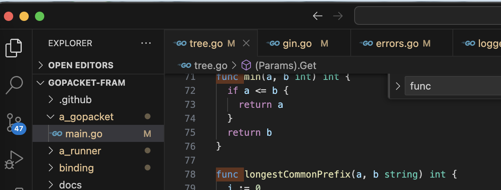

我把代码复制到了 ~/我的本地文件/代码/fromweb 目录下了。目前clone了gin项目和go-gin-example项目，此外还有example项目，这个是gin官方提供的示例项目。

##go-gin-example阅读

读取配置和数据库初始化的过程，可以放在func init() 里，参考：

```go
func init() {
	setting.Setup() // 读取配置文件的所有部分，并对申明好了的全局配置变量赋值
	models.Setup() // 初始化mysql db，并自定义了Create Update Delete时的回调函数
	logging.Setup() // 初始化日志，是基于标准库里面的日志包初始化的
	gredis.Setup() // 初始化redis，包括设置连接redis时会调用的Dial函数
	util.Setup() // 设置pkg包里jwtSecret的值
}
```

init已经看完了，下面就是看 routers.InitRouter() 的具体内容

准备看   r.POST("/auth", api.GetAuth) 及之后的内容了。

项目里使用到了https://github.com/beego/beego框架，用了其validation包做数据验证，其他的包没有使用。

> beego框架可以用于开发包括传统的 Web 网站、API 服务、后台管理系统

validation包的使用方法可以参考：

```go
type auth struct {
	Username string `valid:"Required; MaxSize(50)"` // 这个地方要遵循 validation 的语法
	Password string `valid:"Required; MaxSize(50)"`
}
a := auth{Username: username, Password: password}
ok, _ := valid.Valid(&a)
```

用到了https://github.com/unknwon/com包，这个是针对 Go 编程语言常用函数的开源项目。


router目录存放了rest api的路由定义和rest api的rest部分，而且router的目录结构和路由的结构也是一样的

```shell
.
├── api
│   ├── auth.go
│   ├── upload.go
│   └── v1
│       ├── article.go
│       └── tag.go
└── router.go
```

TODO

全局搜TODO tag，都是一些我没有看懂的逻辑

已经读完了，笔记都记录在了项目里，没有记录在这个文档里面

## gin源代码阅读

我电脑上gin的储存位置为` ~/MyLocalFile/代码/fromweb/gopacket-fram`，改名是为了上班时看便于伪装，这个项目里记录了我阅读时的笔记记录。


gin是一个知名的HTTP web框架。

对于gin的调用处一般都是这样写的：

```go
func main() {
	gin.SetMode(setting.ServerSetting.RunMode)

	routersInit := routers.InitRouter() // 注意
	readTimeout := setting.ServerSetting.ReadTimeout
	writeTimeout := setting.ServerSetting.WriteTimeout
	endPoint := fmt.Sprintf(":%d", setting.ServerSetting.HttpPort)
	maxHeaderBytes := 1 << 20
	server := &http.Server{
		Addr:           endPoint,
		Handler:        routersInit,
		ReadTimeout:    readTimeout,
		WriteTimeout:   writeTimeout,
		MaxHeaderBytes: maxHeaderBytes,
	}

	log.Printf("[info] start http server listening %s", endPoint)
	server.ListenAndServe()
}
```

```go
func InitRouter() *gin.Engine {
	r := gin.New()
	apiv1 := r.Group("/api/v1")
	apiv1.Use(jwt.JWT())
	{
		//获取标签列表
		apiv1.GET("/tags", v1.GetTags)
    // ....
		//生成文章海报
		apiv1.POST("/articles/poster/generate", v1.GenerateArticlePoster)
	}
	return r
}
```

gin项目没有main.go文件，其实：

```go
func New() *Engine {
}
```

可以理解为通常的入口文件。

返回的Engine实现了http的ServeHTTP方法

```go
type Handler interface {
	ServeHTTP(ResponseWriter, *Request)
}
```

> gin官方提供了一个example项目，https://github.com/gin-gonic/examples，里面列举了一些gin的用法

go:build 是一个编译指令（build constraint），用于在不同的Go版本或操作系统之间条件编译代码。`!go1.20`表示如果Go版本小于1.20，那么以下代码块将会被编译，否则将被忽略。`go1.20` 表示如果Go版本等于1.20或更高，那么以下代码块将会被编译，否则将被忽略。

golang有个类型是any，是原生的，其作用和interface相同，其实是interface的别名

1.16更新

看关于cleanPath的实现


## 进度记录

1.18准备看这个tree.go文件



还是在看tree相关的

> gin的路由功能使用了“前缀树“的数据结构
>
> [参考](https://cloud.tencent.com/developer/article/2255850)
>
> 前缀树的插入操作是添加一个新的字符串到 Trie 树中并尝试最小化[数据存储](https://cloud.tencent.com/product/cdcs?from_column=20065&from=20065)（即对某些节点进行合并）。
>
> 因为基数树的本质依然属于字典树，因此在查找使用上和字典树并无不同。从根节点开始遍历字符串，对于每个字符，检查当前节点的子节点是否包含该字符，如果包含，则继续遍历下一个字符，否则说明该字符串不存在于 Radix 树中。
>
> Radix 树的查找操作相对于 Trie 树的查找操作有一个优点，**因为基数树通过压缩，使得在前缀有一定规律的串在树中的深度更低，因此查找效率也较高。**
>
> 因为 Engine 就实现了 ServeHTTP，这里会将 Engine 本身传给 ListenAndServe 方法，当监听的端口有新的连接时，ListenAndServe 会负责 accept 建立连接，并且在连接上有数据时，会调用 handler 的 ServeHTTP 方法进行处理。

阅读源代码可以参考[网上的文章](https://wmf.im/p/gin-%E6%A1%86%E6%9E%B6%E6%BA%90%E7%A0%81%E9%98%85%E8%AF%BB%E7%AC%94%E8%AE%B0/)，围绕gin的这几个特点来阅读：

- Middleware support
- Crash-free
- JSON validation
- Routes grouping
- Error management
- Rendering built-in/Extendable


1.31 在看

## runtime.Caller

a_tester下的func stack(skip int) []byte 

关于runtime.Caller函数：

用于获取调用栈的信息，包括调用者的文件名、行号和函数名。函数定义为：

```shell
func Caller(skip int) (pc uintptr, file string, line int, ok bool)
```

- `pc` 表示调用者函数的程序计数器（program counter），用于标识调用者函数的指令地址。
- `file` 表示调用者函数所在的文件名。
- `line` 表示调用者函数所在的行号。
- `ok` 表示是否成功获取了调用者的信息，如果成功为 true，否则为 false。当传递的i值太大了，没有对应的调用者信息，返回的ok就是false。

传递0表示调用Caller函数的位置的信息，传递1表示调用Caller函数的位置所在函数 的调用者的信息，比如：

```go
func main() {
	stackTest(0)
}

func stackTest(i int) {
	pc, file, line, ok := runtime.Caller(i)
	fmt.Println("..........", pc, file, line, ok)
}
```

传递0打印出来的结果是：

```shell
.......... 17359146 /Users/rhettnina/MyLocalFile/代码/fromweb/gopacket-fram/a_tester/main.go 15 true
```

也就是调用runtime.Caller这一行的代码信息，包括所在文件，行号等等

传递1打印出来的结果是：

```shell
.......... 17359069 /Users/rhettnina/MyLocalFile/代码/fromweb/gopacket-fram/a_tester/main.go 11 true
```

因为调用runtime.Caller的函数是stackTest，也就是runtime.Caller的一级调用者是stackTest，传递0返回的是1级调用者的调用详情。传递1表示的是一级调用者的调用者 也就是二级调用者的调用信息，二级调用者main函数是在main.go的第11行调用的。


