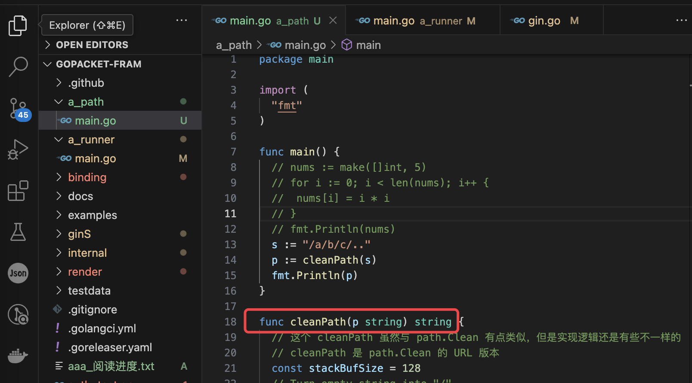

我把代码复制到了 ~/我的本地文件/代码/fromweb 目录下了。目前clone了gin项目和go-gin-example项目，此外还有example项目，这个是gin官方提供的示例项目。

##go-gin-example阅读

读取配置和数据库初始化的过程，可以放在func init() 里，参考：

```go
func init() {
	setting.Setup() // 读取配置文件的所有部分，并对申明好了的全局配置变量赋值
	models.Setup() // 初始化mysql db，并自定义了Create Update Delete时的回调函数
	logging.Setup() // 初始化日志，是基于标准库里面的日志包初始化的
	gredis.Setup() // 初始化redis，包括设置连接redis时会调用的Dial函数
	util.Setup() // 设置pkg包里jwtSecret的值
}
```

init已经看完了，下面就是看 routers.InitRouter() 的具体内容

准备看   r.POST("/auth", api.GetAuth) 及之后的内容了。

项目里使用到了https://github.com/beego/beego框架，用了其validation包做数据验证，其他的包没有使用。

> beego框架可以用于开发包括传统的 Web 网站、API 服务、后台管理系统

validation包的使用方法可以参考：

```go
type auth struct {
	Username string `valid:"Required; MaxSize(50)"` // 这个地方要遵循 validation 的语法
	Password string `valid:"Required; MaxSize(50)"`
}
a := auth{Username: username, Password: password}
ok, _ := valid.Valid(&a)
```

用到了https://github.com/unknwon/com包，这个是针对 Go 编程语言常用函数的开源项目。


router目录存放了rest api的路由定义和rest api的rest部分，而且router的目录结构和路由的结构也是一样的

```shell
.
├── api
│   ├── auth.go
│   ├── upload.go
│   └── v1
│       ├── article.go
│       └── tag.go
└── router.go
```

TODO

全局搜TODO tag，都是一些我没有看懂的逻辑

已经读完了，笔记都记录在了项目里，没有记录在这个文档里面

## gin源代码阅读

我电脑上gin的储存位置为` ~/MyLocalFile/代码/fromweb/gopacket-fram`，改名是为了上班时看便于伪装，这个项目里记录了我阅读时的笔记记录。


gin是一个知名的HTTP web框架。

对于gin的调用处一般都是这样写的：

```go
func main() {
	gin.SetMode(setting.ServerSetting.RunMode)

	routersInit := routers.InitRouter() // 注意
	readTimeout := setting.ServerSetting.ReadTimeout
	writeTimeout := setting.ServerSetting.WriteTimeout
	endPoint := fmt.Sprintf(":%d", setting.ServerSetting.HttpPort)
	maxHeaderBytes := 1 << 20
	server := &http.Server{
		Addr:           endPoint,
		Handler:        routersInit,
		ReadTimeout:    readTimeout,
		WriteTimeout:   writeTimeout,
		MaxHeaderBytes: maxHeaderBytes,
	}

	log.Printf("[info] start http server listening %s", endPoint)
	server.ListenAndServe()
}
```

```go
func InitRouter() *gin.Engine {
	r := gin.New()
	apiv1 := r.Group("/api/v1")
	apiv1.Use(jwt.JWT())
	{
		//获取标签列表
		apiv1.GET("/tags", v1.GetTags)
    // ....
		//生成文章海报
		apiv1.POST("/articles/poster/generate", v1.GenerateArticlePoster)
	}
	return r
}
```

gin项目没有main.go文件，其实：

```go
func New() *Engine {
}
```

可以理解为通常的入口文件。

返回的Engine实现了http的ServeHTTP方法

```go
type Handler interface {
	ServeHTTP(ResponseWriter, *Request)
}
```

> gin官方提供了一个example项目，https://github.com/gin-gonic/examples，里面列举了一些gin的用法

go:build 是一个编译指令（build constraint），用于在不同的Go版本或操作系统之间条件编译代码。`!go1.20`表示如果Go版本小于1.20，那么以下代码块将会被编译，否则将被忽略。`go1.20` 表示如果Go版本等于1.20或更高，那么以下代码块将会被编译，否则将被忽略。

golang有个类型是any，是原生的，其作用和interface相同，其实是interface的别名

1.16更新

看关于cleanPath的实现




