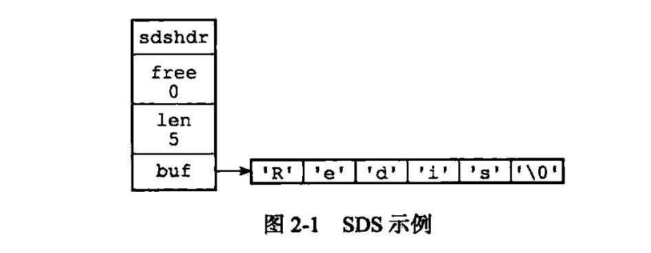
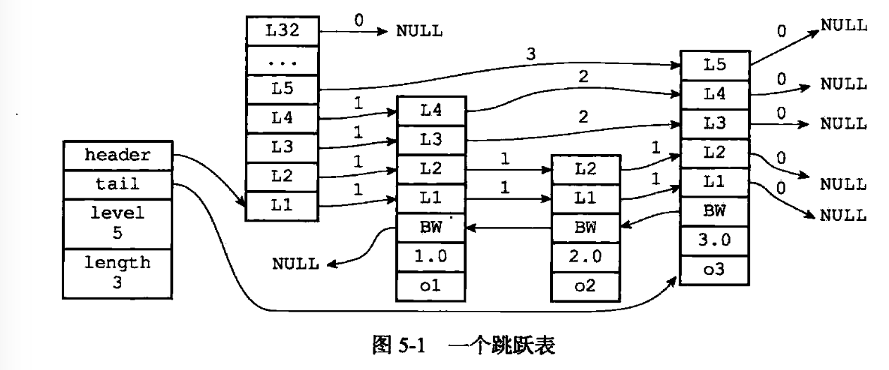
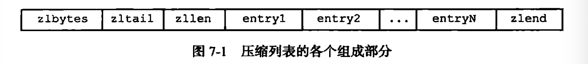

> 本阅读的记录会把所有的大小标题都记录下来，因为记录标题相当于梳理大纲目录，有助于理解redis的大致结构。

## 前言

redis内置了集合数据类型，并支持对集合进行执行交集、并集、差集等集合操作，解决了作者当下的问题。作者开始思考：

redis的五种数据类型分别是由什么数据结构实现的？

redis的字符串数据类型既可以存储字符串。也可以存储整数和浮点数，甚至是二进制位（使用SETBIT等命令），那么redis又如何在内部存储这些值的呢？

redis是用C语言写的，故下文贴出来的代码都是C的代码。

## 第一部分 数据结构与对象

### 第2章 简单动态字符串

redis没有使用C语言传统的字符串表示（以空字符结尾的字符数组），而是自己构建了一种叫简单动态字符串（simple dynamic string，SDS）的抽象类型，使用该类型作为redis的默认字符串表示。

当redis需要的不仅仅是一个字符串字面量，而是可以可以被修改的字符串值，redis就会使用SDS类型。

#### 2.1 SDS的定义

SDS的源代码定义如下：

```c
struct sdshdr {
	// 记录buf数组中已使用字节的数量
	// 等于SDS所保存的字符串的长度
	int len;
	// 记录buf数组中未使用的字节的数量
	int free;
	// 字节数组，用于保存字符串
	char buf[];
}
```



图上的最后一个字节保存的是空字符串，保存空字符串的一个字节不计算在SDS的len属性里。因为C里字符串的结尾就使用了空字符串作为标记（C字符串本身不记录字符串的长度，对于一个包含了N个字符的C字符串，这个字符串的底层总是一个N+1个字符长的数组）。使用空字符串是为了SDS可以直接使用C里面的一些关于字符串的函数。

#### 2.2 SDS与C字符串的区别

##### 2.2.1 常熟复杂度获取长度

SDS在len里记录了SDS本身的长度，所以获取SDS的长度的时间复杂度是O(1)。

##### 2.2.2 杜绝缓冲区溢出

##### 2.2.3 减少修改字符串时带来的内存重分配次数

对于C字符串，每次增长或者缩短一个C字符串，程序总是对保留这个C字符串的数组进行一次内存重新分配的操作：如果是增长字符串，比如拼接操作，那么执行这个操作前，程序会通过内存重分配来扩展底层数组的大小，**否则会发生缓冲区溢出。**对于缩小字符串，那么需要释放掉那部分不用的字符串，**否则会发生内存泄漏。**

因为内存重新分配涉及到复杂的算法，其实这是一个比较耗时的过程。为了优化该耗时，SDS通过未使用空间接触了字符串长度和底层数组长度之间的关系。在SDS中，buf数字长度不一定就是字符串数量加一，数字长度里面可以包含未使用的字节，而这些字节的数量由SDS的free属性记录。

通过未使用空间，SDS实现了空间预分配和惰性空间释放两种优化策略。

空间预分配：当对SDS进行空间扩展时，不仅会分配修改所需要的空间，还会分配额外未使用的空间。比如进行修改后，SDS的len变成了13字节，那么程序也会分配13字节的未使用空间，那么SDS的buf的数组长度是13+13+1字节。

惰性空间释放：当SDS需要缩短字节时，程序不会立刻回收不用的字节，会使用free属性将这些字节的数量记录起来，等待将来使用。这里其实不算真正的释放内存。

但是SDS还提供了API，让我们在真正需要的时候，调用API来真正释放SDS的未使用空间，所以不用担心惰性空间释放策略造成内存浪费。

##### 2.2.4 二进制安全

C字符串必须符合某种编码，并且除了字符串的末尾外，字符串不能包含空字符串，该限制导致C字符串只能保存文本数据，而不能保存图像、音频、视频、压缩文件这样的二进制数据。

SDS API都会以处理二进制的方式来处理SDS存放的buf数组中的数据。

### 第3章 链表

#### 3.1 链表和链表节点的实现

```c
typedef struct listNode {
	// 前置节点
	 struct listNode *prev;
	 // 后置节点
	 struct listNode *next;
	 // 节点的值
	 void *value;
}listNode;
```

多个listNode可以通过prev和next指针组成双端链表。

**每个链表使用一个list结构来存储**，这个结构带有表头节点指针，表尾节点指针以及链表长度信息。

### 第4章 字典

#### 4.1 字典的实现

字典其实就和map差不多，是一种保存键值对（key-value pair） 的抽象数据结构。redis的数据库就是使用字典作为底层实现的。

redis的数据库就是使用字典作为底层实现的。

注意一些说法要标准，比如下面的这些都是比较标准的说法：哈希值的键是XXX，哈希值的值是XXX

redis使用哈希表作为底层实现，一个哈希表里可以有多个哈希表节点，而每个哈希表节点就保存了字典中的一个键值对

哈希表的定义结构如下：

```c
typeof struct dictht {
	// 哈希表数组
  // 数组里的每一个元素都指向一个数据结构dictEntry，该数据结构里保存着一个键值对。
	dicEntry **table;
	// 哈希表大小
	unsigned long size;
	// 哈希表大小掩码，用于计算索引值
	// 总是等于size-1
  // 和哈希值一起决定了一个键应该被放到哈希table数组的哪一个索引上
	unsigned long. sizemask;
	// 该哈希表已有节点的数量
	unsigned long used;
} dictht;
```

#### 4.2 哈希算法

#### 4.3 解决键冲突

dictEntry里有一个字段，该字段是一个指针，指向了下一个哈希表节点，形成了链表。这个指针可以将多个哈希值相同的键值对连接在一起，由此解决键值对冲突的问题。

字典的数据结构类型如下：

```c
typeof struct dict{
	// 类型特定函数
	dictType *type;
	// 私有数据
	void *private;
	// 哈希表
	dictht ht[2];
	// rehash索引
	// 当rehash不存在时，值为-1
	in trenhashidx;
}dict;
```

type和private字段是针对不同类型的键值对，为创建多态字段而设置的。他们包含了计算哈希值，复制键，复制值，对比键，对比值，销毁键，销毁值等函数。

而dictht指定为ht[2]，其长度为2，一般情况下值使用ht[0]，ht[1]哈希表只会在ht[0]哈希表进行rehash时使用。

当键冲突时，重复的多个哈希表节点可以使用next指针构成一个单向链表，被分配到同一个索引上的多个节点可以用这个单向链表连接起来，这样就解决了键冲突的问题。

因为dictEntry没有指向链表尾部的指针，所以程序总是将新节点添加到链表的表头位置（复杂度为O(1)），排在其他已有节点的前面。

#### 4.4 rehash

当检测到哈希表的负载因子不合理时，就会执行rehash操作。哈希表的负载因子小于0.1时，程序会对哈希表进行收缩操作。目前满足以下两种情况就会执行rehash：

1）服务器目前没有在执行BGSAVE命令或者BGREWRITEAOF命令，且负载因子大于等于1.

2）服务器目前正在执行BGSAVE命令或者BGREWRITEAOF命令，且负载因子大于等于5.

此外注意：执行BGSAVE命令或者BGREWRITEAOF命令的执行过程中，redis需要创建当前服务器进程的子进程，

#### 4.5 渐进式rehash

渐进式rehash的过程中，对于查找键的操作，程序会先在ht[0]里查找，找不到的话会继续到ht[1]查找。

#### 4.6 字典API

### 第五章 跳跃表

跳跃表（skiplist）是一种数据结构，通过在每个节点维持多个指向其他节点的指针，从而达到快速访问节点的目的。

跳跃表支持平均O(logN)，最坏O(N)复杂度的节点查找

redis使用跳跃表作为**有序集合键**的底层实现之一

redis只在两个地方用到了跳跃表，一个是有序集合键，一个是在集群节点内用作内部数据结构

#### 5.1. 跳跃表的实现

一个跳跃表的结构如下：



header指向表头，tail指向表尾节点

level记录表内层数最大的那个节点的层数

length记录跳跃表的长度，不包含表头节点

图上节点之间向右指的节点都是前进指针，向左的就是那个BW，是后退指针，后退指针在表尾向表头遍历时使用。

图上的1.0，2.0，3.0是每个节点所保存的分值，o1 o2 o3则是每个节点所保存的成员对象

表头节点也有分值和成员对象，但是这些属性不会被使用，所以图上忽略了这些属性。

图上箭头上的数值表示跨度，跨度实际上是用来计算排位的，在查找某个节点的过程中，将沿途访问过的所有层的跨度加起来，得到的结果就是目标节点在跳跃表中的排位。

#### 5.2 跳跃表API

### 第六章 整数集合

整数集合简称intset。比如下面的集合键底层实现就是整数集合：

```shell
redis > SADD numbers 1 3 5 7 9
5
redis > OBJECT ENCODING number
"intset"
```

#### 6.1 整数集合的实现

intset结构的定义如下：

```c
typeof struct intset{
	// 编码方式
	uint32_t encoding;
	// 集合包含的元素数量
	uint32_t length;
	// 保存元素的数组
	int8_t contents[];
}intset;
```

contents存储了各个元素，各项在contents数组的大小从小到大有序排列，并且数组中不包含重复项。

#### 6.2 升级

如果要将一个新元素添加到整数集合里，并且新元素的类型比整数集合现有的所有元素的类型都要长的时候，整数集合需要先进行升级（upgrade），然后才能将新元素添加到整数集合里。

比如向int16的数组添加int32的元素，就需要升级了。

升级的过程就是如下三步：

1. 根据新元素的类型，扩展整数集合底层数组的空间大小，并且为新元素分配空间。

2. 将底层数组现有的所有元素都转换成和新元素相同的类型，并且类型转换后的元素放到正确的位上，放置的过程需要维持底层数组的有序性质不变。

3. 将新元素添加到底层数组中。

因为每次挺假新元素的过程中可能会引起升级，每次升级都需要对底层数组的已有元素进行转换，所以向底层数组添加元素的时间复杂度是O(N)。

#### 6.3 升级的好处

提升灵活性：因为C是静态类型语言，为了避免类型错误，一般不会把两种类型的值放在同一个数据结构里面。

节约内存

#### 6.4 降级

整数集合不支持降级操作。一旦升级后就会保持升级后的状态，即使把之前插入时触发升级的那个元素删掉。

#### 6.5 整数集合API

### 第七章 压缩列表

压缩列表（ziplist）是列表键和哈希键的底层实现之一。

当一个列表键包含少量的列表项，并且每个列表项要么是小整数，要么是长度比较短的字符串，那么redis就会使用压缩列表作为该列表键的底层实现。

下面这个列表键里可以放很多类型不同的值。

```c
redis > RPUSH 1st 1 3 5 10086 "hello" "world"
(integer) 6
redis > OBJECT ENCODING 1st
"ziplist"
```

比如上面这个列表键可以放不同的类型，且放的都是上面说的简单值，那么其底层就会使用压缩列表。

此外，某个哈希键只包含少量的键值对时，键和值都是比较小的整数或者都是短的字符串，redis就会使用压缩列表作为哈希键的底层实现。如下，可以看到其使用的是压缩列表：

```c
redis > HMSET profile "name" "Jack" "age" 28 "job" "Programmer"
OK
redis > OBJECT ENCODING profile
"ziplist"
```

#### 7.1 压缩列表的构成

压缩列表是为了节约内存而开发的，是由一系列特殊编码的连续内存块组成的顺序型（sequential）数据结构。一个压缩列表可以包含多个节点（entry），每个节点可以保存一个节点数组或者一个整数值。



#### 7.2 压缩列表节点的构成

每个压缩列表节点可以保存一个字节数组或者一个整数值。

#### 7.3 连锁更新

添加新节点要压缩列表，或者从压缩列表删除节点，可能会触发连锁更新操作，但是这种操作出现的几率不高。

#### 7.4 压缩列表API

### 第八章 对象

redis的主要输结构有简单动态字符串（SDS），双端链表，字典，压缩列表，整数集合等等。

redis并没有直接使用这些数据结构来实现键值对数据库，而是基于这些数据结构创建了一个对象系统。这个系统包含字符串对象、列表对象、哈希对象、集合对象和有序集合对象这五种类型的对象，每种对象都用到了前面所说的至少一种数据结构。

redis的对象系统还实现了基于引用计数技术的内存回收机制，当程序不再使用某个对象的时候，这个对象所占用的内存会被释放，

redis服务器启用了maxmemory功能时，空转时间大的那些键可能会优先被服务器删除。

#### 8.1 对象的类型和编码

redis使用对象来存储数据库的键和值，当我们在redis数据库新创建一个键值对时，我们至少会创建两个对象，一个对象用作键值对的键（键对象），另一个对象用作键值对的值（值对象）。

redis的每个对象都由一个redisObject结构表示：

```c
typeof struct redisObject {
	// 类型
	unsigned type:4;
	// 编码
	unsigned encoding:4;
	// 指向底层实现数据结构的指针
	void *ptr;
}robj;
```

字符串键的定义：指的是这个数据库键所对应的值为字符串对象

列表键的定义：指的是这个数据库键所对应的值为列表对象

使用OBJECT ENCODING命令可以查看一个数据库键的值对象的编码。

使用encoding属性来设定对象所使用的编码，而不是为特定类型的对象关联一种特定的编码，极大的提升了redis的灵活性和效率。

#### 8.2 字符串对象

字符串 对象的编码可以是int raw 或者embstr

embstr是专门用于保存短字符串的一种优化编码方式。embstr编码通过调用一次内存分配函数来分配一块连续的空间。

long double类型表示的浮点数在redis中也是作为字符串值来保存的。

如果通过APPEND命令，在一个保存了整数值的字符串对象追加一个字符串值，因为追加操作只能作用于字符串，所以程序会先把之前保存的整数10086转换为字符串"10086"，然后再对其进行追加操作，操作的结果就是一个raw编码的，保存了字符串值的字符串对象。

embstr编码的字符串对象实际上是只读的。embstr编码的字符串对象在修改命令之后，总会变成一个raw编码的字符串对象。

#### 8.3 列表对象

列表对象的编码可以是ziplist或者linkedlist。

字符串对象是redis五种类型的对象中唯一一种会被其他四种类型对象嵌套的对象。

#### 8.4 哈希对象

哈希对象的编码可以是ziplist或者hashtable。

#### 8.5 对象集合

集合对象的编码可以是intset或者hashtable。

#### 8.6 有序集合对象

有序集合的编码可以是ziplist或者skiplist。

#### 8.7 类型检查与命令多态

redis用于操作键的命令基本上可以分为两种类型：

一种是对任何类型的键指向，比如DEL命令，EXPIRE命令，RENAME命令，TYPE命令，OBJECT命令。

另一种就是只能对特定类型的键执行，比如：

SET、GET、APPEND、STRLEN等命令只能对字符串键执行；

HDEL、HSET、HGET、HLEN等命令只能对哈希键执行。

。。。。。等等

类型检查的发现：执行特定操作前redis会先检查该键的类型，看看能不能执行该操作。 类型检查是通过redisObject结构的type属性来实现的。

多态命令的实现：对一个键实行LLEN命令时，服务器会根据键的值对象所使用的编码来选择正确的LLEN命令。如果对象编码是ziplist，那么说明列表对象的实现为压缩列表，程序会使用ziplistLen函数返回列表的长度。如果列表对象的编码为linkedlist，说明列表对象的实现为双端链表，程序会使用listLength函数返回双端链表的长度。

除了LLEN命令，DEL、EXPIRE、TYPE命令都是多态命令。但是这些是基于类型的多态，而LLEN是基于编码的多态。

#### 8.8 内存回收

redis在自己的对象系统中构建了一个引用计数（reference counting）技术来实现内存回收。

创建一个新对象时，引用计数的值会被初始化为1。

有一个修改对象计数的API是resetRefCount，这是除了计数值加一和减一（减一这个API会在当对象的引用计数值为0时，释放对象）这两个API的第三个API，这个API会将对象的引用计数值设置为0，但是不释放这个对象，这个函数通常在需要重新设置对象的引用计数值时使用。

#### 8.9 对象共享

共享对象机制对于节约内存非常有帮助。

redis会在初始化服务器时，创建一万个字符串对象，这些对象包含了从0到9999的所有整数值，当服务器需要使用值为0到999的字符串对象时，服务器就会使用这些共享对象，而不是创建新对象。

比如当创建值为100的键A后，使用OBJECT REFCOUNT命令可以查看键A的值对象的引用计数，会发现该值对象的引用计数为2。引用100的两个程序分别为持有这个值对象的服务器程序，以及共享这个值对象的键A。

#### 8.10 对象的空转时长

OBJECT IDLETME可以打印出键的空转时长，空转时长就算当前时间减去键最后一次被命令程序访问的时间。

#### 8.11 重点回顾

redis的每个键值对的键和值都是一个对象

redis有五种类型的对象，每种类型的对象至少都有两种或者以上的编码方式，不同的编码方式在不同的使用场景上优化对象的使用效率。

服务器在执行某些命令前，会检查给定键的类型能否执行指定的命令。而检查一个键的类型就是检查一个键的值对象的类型。

redis对象会记录自己最后一次被访问的时间，这个时间可以用于计算对象的空转时间。

## 第二部分 单机数据库的实现

### 第9章 数据库

#### 9.1 服务器中的数据库

redis将所有的数据库都保存在服务器状态redis.h/redisServer结构的db数组中，db数组中的每个项都是一个redis.h/redisDb结构，每个redisDb结构代表了一个数据库。

redis服务器默认会创建16个数据库。

#### 9.2 切换数据库

每个redis客户端都有自己的目标数据库，每当客户端执行数据库写命令或者数据库读命令时，目标数据库就会成为这些命令的操作对象。

默认情况下，redis客户端的目标数据库是0号数据库。但是客户端可以通过SELECT命令来切换目标数据库。

如果在某号数据库写数据，切换到另外一号数据库是读不出到之前写的数据的。

redis-cli会显示当前目标数据库库的号码，但是很多其他语言的redis客户端不会显示当前目标数据库的号码，操作时需要注意，心中要知晓当前操作的目标数据库是什么。

#### 9.3 数据键空间

redisDb结构的dict字典保存了数据库中的所有键值对，这个字典被称为键空间。

所有针对键的操作了比如添加一个键到数据库，或者从数据库删除一个键，都是通过对键空间字段进行操作来实现的。

用于返回数据库键数量的DBSIZE命令，就是通过返回键空间中包含的键值对数量来实现的。

如果客户端使用WATCH命令监视了某个键，那么服务器在对被监视的键进行修改后，会标记这个键为dirty（脏），从而让事务程序注意到这个键已经被修改过了。

#### 9.4 设置键的生存时间或过期时间

TTL命令和PTTL命令接收一个带有生存时间或者过期时间的键，返回这个键的剩余生存时间，也就是返回这个键被服务器自动删除还有多长时间。

EXPIRE、PEXPIRE（将键的过期时间设置为ttl毫秒，和EXPIRE的不同就是指定时间的单位不同）的最终执行效果和EXPIREAT（指定键的过期时间为某个秒级时间戳）的执行效果相同。

PERSIST命令可以移除一个键的过期时间：

```shell 
redis > PERSIST message
(integer) 1
redis > TTL message
(integer) -1
```

#### 9.5 过期键删除策略

有以下的三种删除策略：

定时删除：在设置键的过期时间的同时，创建一个定时器（timer），让定时器在键的过期时间来临时，立即执行对键的删除操作。这个操作对CPU时间是最不友好的。

惰性删除：每次获取键时，才会检查该键是否过期，过期的话就删除。除非用户手动执行FLUSHDB，否则有些键可能永远不会被删除，其实上这算是一种内存泄漏。

定期删除：每隔一段时间，程序就对数据库进行一次检查，删除里面的过期键。

#### 9.6 redis的过期键删除策略

定时删除的策略是分多次遍历服务器中的各个数据库，从数据库的expires字典随机检查一部分键的过期时间，并删除其中的过期键。

#### 9.7 AOF、RDB和复制功能对过期键的处理

在执行SAVE命令或者BGSAVE命令创建一个新RDB文件时，程序会对数据库的键进行检查，已过期的键不会被保存到RDB文件里。

如果服务器以服务器模式运行，那么在载入RDB文件时，文件中保存的所有键，无论是否过期，都会被载入到数据库中。

以AOF持久化模式运行时，当过期键被惰性删除或者定期删除时，程序会向AOF文件追加append一条DEL命令，来显示的记录该键已经被删除。

当服务器运行在复制模式下时，从服务器的过期键删除动作由服务器主动控制。

通过由主服务器来控制从服务器统一的删除过期键，可以保证主从服务器数据的一致性，也是因为这个原因，当一个过期键仍然存在于主服务器的数据库时，这个过期键在从服务器的复制品也会继续存在。

#### 9.8 数据库通知

该功能可以让客户端通过订阅给定的频道或者模式，来获知数据库键的变化，以及数据库中命令的执行情况。比如可以获取0号数据库中针对message键执行的所有命令：

```shell
SUBSCRIBE _ _keyspace@0_ _:message
```

#### 9.9 重点回顾

 数据库主要由dict和expires两个字典构成，其中dict字典负责保存键值对，而expires字典则负责保存键的过期时间。

数据库的键总是一个字符串对象，而值可以是任意一种redis对象类型。

当主服务器删除一个过期键时，它会向所有的从服务器发送一条DEL命令，显式删除过期键。

从服务器发现过期键也不会自作主张的显示删除它，而是等待主服务器发送DEL命令，这种统一、中心化的过期键删除策略可以保证服务器数据的一致性。

当redis命令对数据库进行修改后，服务器会根据配置向客户端发送数据库通知。

### 第10章 RDB持久化

我们将服务器中的非空数据库以及它们的键值对统称为数据库状态。

#### 10.1 RDB文件的创建与载入

SAVE命令会阻塞redis服务器进程，直到RDB文件创建完毕为止。

与SAVE命令直接阻塞服务器进程的做法不同，BGSAVE命令会派生出一个子进程，然后由子进程负责创建RDB文件。创建子进程是通过fork命令创建的，比如`pid = fork()`，子进程完成后会向父进程发送信号：`signal_parent()	`

RDB文件的载入工作是在服务器启动时自动执行的

redis服务器启动时会打印日志，其中一条日志是`DB loaded from diisk	`，这个表明服务器成功载入了RDB文件，载入成功后就打印了这条日志。

AOF文件的更新频率通常比RDB文件高，所以如果服务器开启了AOF持久化功能，服务器会优先使用AOF文件来还原数据库状态，因为AOF文件更为准确。

如果有两个或者多个子进程同时执行大量的磁盘写入程序，这都是不推荐的。

#### 10.2 自动间隔性保存

redis允许用户通过设置服务器配置的save选项，让服务器每隔一段时间就自动执行一次BGSAVE命令。

比如向服务器提供的配置为：

```shell
save 900 1
save 300 10
save 60 10000
```

表示满足以下三个条件中的任意一个，BGSAVE命令都会被执行：

服务器在900秒内，对数据库做了至少1次修改。

服务器在300秒内，对数据库做了至少10次修改。

服务器在60秒内，对数据库做了至少10次修改。

#### 10.3 RDB文件结构

RDB文件的最开头是redis部分，这个部分的长度为你5字节，保存着"REDIS"这五个字符，通过这五个字符，程序可以在载入文件时，快速检查所载入的文件是否是RDB文件。

"REDIS"这五个字符，保存的是不带'\0'结尾符号的C字符串。

一个RDB文件的database部分可以保存任意多个非空数据库。

不带过期时间的键值对在RDB文件中由TYPE、key、value三个部分组成。

#### 10.4 分析RDB文件

redis自带来RDB文件的检查工具 redis-check-dump

#### 10.5 重点回顾

RDB文件是一个经过压缩的二进制文件，由多个部分组成

对于不同类型的键值对，RDB文件会使用不同的方式来保存它们。

### 第11章 AOF持久化


准备看142


