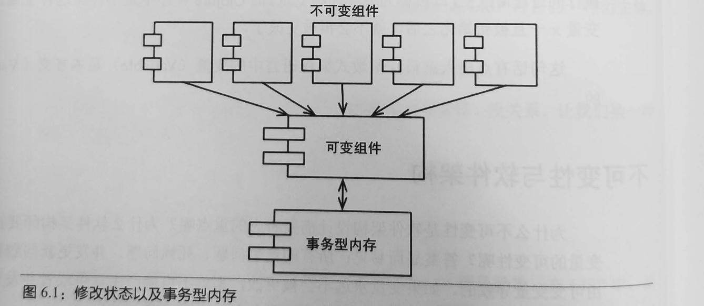
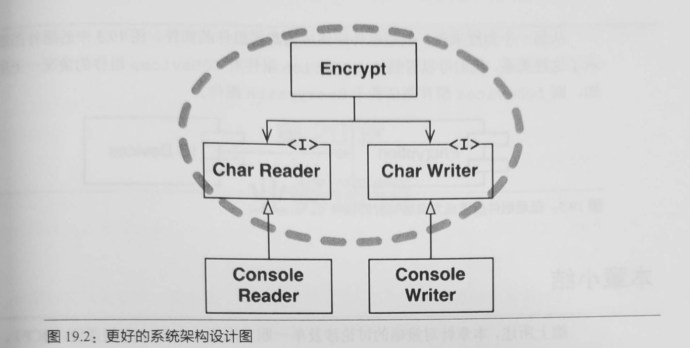
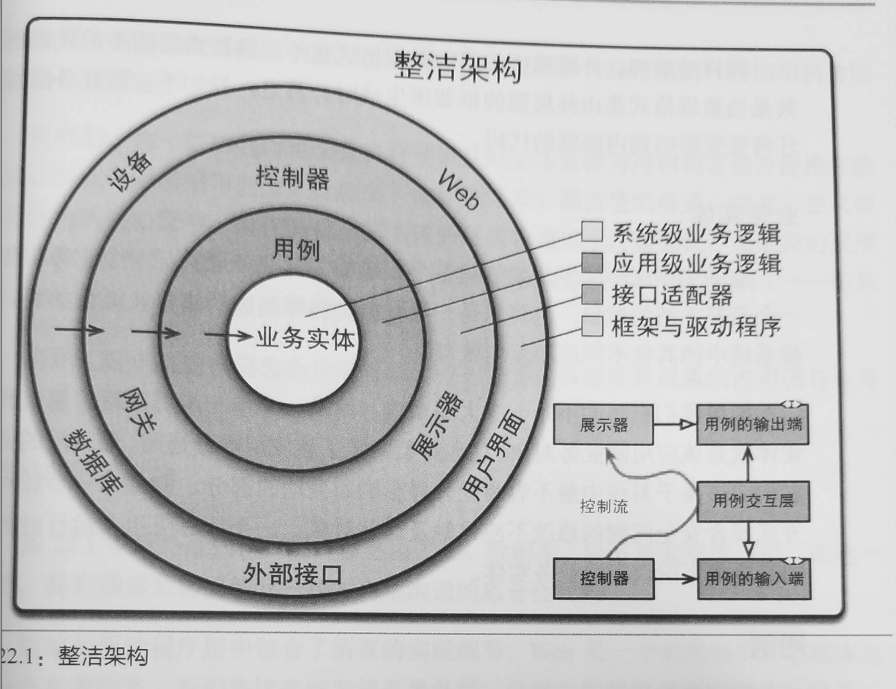

程序可以分为：普通程序员，工程师和架构师。

大家对面向对象编程的一般理解是：由封装、继承和多态三种特性支持的。

大家对函数式编程的一般理解是：以函数为基本单元、没有变量（更准确的说是不能重复赋值）也没有副作用的编程方式。但是从更深层的层次来看，它彻底隔离了可变性，变量或者状态默认就是不可变的。如果要变化，则必须经过合理设计的专门机制来实现，所以也避免了死锁、状态冲突等众多麻烦。

软件架构（architecture）关注的一个重点是组织结构（structure），不管是组件（component）类（class）函数（function）模块（module）还是层级（layer）服务（service）以及微观与宏观的软件开发过程，软件的组织结构都是我们的主要关注点。

有一点很重要：今天的软件和过去的软件本质上依然是一样的，都是由if语句，赋值语句以及while循环组成的。

## 第一部分 概述

### 第一章 设计与架构究竟是什么

#### 目标是什么

“架构“这个词往往使用于”高层次“的讨论中，这类讨论一般都把”底层“的实现细节排出在外。而”设计“一词，往往用来指代具体的系统底层组织结构和实现的细节。但是从一个真正的系统架构师的日常工作来看，这样的区别是不成立的。

软件架构的终极目标是，用最小的人力成本来满足构建和维护系统的需求。

#### 案例分析

#### 本章小结

不管怎么看，研发团队最好的选择就是清晰的认识并避开工程师们过度自信的特点，开始认真地对待自己的代码架构，对其质量负责。

要想提高自己软件架构的质量，就需要知道什么是优秀的软件架构。而为了在系统构建过程中采用好的设计和架构以便减少构建成本，提高生产力，又需要先了解系统架构的各种属性与成本和生产力的关系。

这就是本书的主题。本书为读者描述了什么是优秀的、整洁的软件架构与设计，读者可以参考这些设计来构建一个长期稳定的、持久的系统。

### 第2章 两个价值维度

#### 行为价值

软件系统的行为是其最直观的价值维度。

#### 架构价值

软件应该容易修改。

#### 哪个价值维度更重要

如果程序可以正常工作，但是无法修改，那么需求变更时它就无法正常工作了，也就无法修改它让它正常工作。因此，程序的价值会是0。

如果某程序目前无法正常工作，但是可以轻易修改，那么随着需求更改将会很容易。因此这个程序会持续产生价值。

#### 艾森豪威尔矩阵

总结起来就是：我有两种难题：紧急的和重要的，而紧急的难题永远是不重要的，而重要额难题永远是不紧急的。


#### 为好的软件架构而持续斗争

如果忽略软件架构的价值，系统将会变得越来越难以维护，那么终有一天，系统将会变得再也无法修改。

## 第2部分 从基础构建开始：编程范式

阿兰‘图灵石第一个提出“程序即数据”的人。

计算机编程领域还经历了另外一个更巨大、更重要的变革，那就是编程范式（paradigm）的变迁，**编程范式指的是程序的编写模式，**与具体的编程语言的关系相对较小。这些范式会告诉你应该在什么时候才用什么样的代码结构，直到今天，我们一共只有三个编程范式。

### 第3章 编程范式总览

本章讲讲述三个编程范式，它们分别是结构化编程（structured programming）、面向对象编程（object-oriented programming）以及函数式编程（functional programming）。

#### 结构化编程

1968年提出。Dijkstra论证了使用goto这样的无限制跳转语句将会损害程序的整体结构。Dijkstra也最先主张用我们现在所熟知的if/then/else语句和do/while/until语句来代替跳转语句的。

可以将结构化编程范式规结为一句话：**编程化范式对程序控制权的直接转移进行了限制和规范。**

#### 面向对象编程

最开始的一个例子是：程序员注意到ALGOL语言中，函数调用堆栈（call stack frame）可以被挪到堆内存区域里，这样函数定义的本地变量就可以在函数返回之后继续存在。这样函数就成为一个类（class）的构造函数，而它所定义的本地变量就是类的成员函数，构造函数定义的嵌套函数就成为了成员方法（method），这样依赖，我们就可以利用多态（polymorphism）来限制用户对函数指针的使用。

**面向对象编程对程序控制权的间接转移进行了限制和规范。**

#### 函数式编程

从理论上来说，函数式编程语言中应该是没有赋值语句的，大部分函数式编程语言只允许在非常严格的限制条件下，才可以更改某个变量的值。

函数式编程对程序中的赋值进行了限制和规范。

#### 仅供思考

#### 本章小结

多态是我们跨越架构边界的手段，函数式编程是我们规范和限制数据存放位置和访问权限的手段，结构化编程则是各模块的算法实现基础。

### 第4章 结构化编程

#### 可推导性

Dijkstra提出采用数学推导方法用于解决编程中的错误。他的想法是借鉴数学中的公理（Postulate）、定理（Theorem）、推论（Corollary）和饮理（Lemma），形成一种欧几里得结构。而且他在研究中发现了一个问题：goto语句的某些用法会导致某个模块无法被递归拆分成更小的、可证明的单元，这会导致无法采用分解法来将大型问题进一步拆分成更小的、可证明的单元。但是goto的其他用法虽然不会导致这种问题，但是Dijkstra意识到它们的实际效果其实和更简单的分支结构if- then- else以及循环结构do- while是一致的，那么代码只采用这两种控制结构，则一定可以将程序分解为更小的、可证明的单元。

#### goto是有害的

#### 功能性讲解拆分

#### 形式化证明没有发生

#### 科学来救场

#### 测试

Dijkstra说过“测试只能展示Bug的存在，并不能证明不存在Bug"

结构化编程范式促使我们先将一段程序递归降解为一系列可证明的小函数，然后再编写相关的测试来试图证明这些函数是错误的，如果这些测试无法证伪这些函数，那么我们可以认为这些函数是足够准确的，进而推导出整个程序是准确的。

#### 本章小结

结构化编程中最有价值的地方就是，它赋予了我们创造可证伪程序单元的能力，

无论在哪一个层面上，由最小的函数到最大的组件，软件开发的过程都和科学研究非常类似，它们都是由证伪驱动的，软件结构师需要定义可以方便地进行证伪（测试）的模块、组件以及服务，为了达到这个目的，他们需要将类似结构化编程方法应用在更高的层面上。

### 第5章 面向对象编程

面向对象语言包含了封装（encapsulation）、继承（inheriance）、多态（polymorphism）。

#### 封装

通过采用封装特性，我们可以把一组相关联的数据和函数圈起来，是的圈外的代码只能看见部分函数，数据则完全不可见。譬如在实际运用中，类（class）中的公共函数和私有变量就是这样。

下面查看一个简单的C程序：

```c
point.h
------------------------------------------------------------------------------
struct Point;
struct Point* makePoint(double x, double y);
double distance(struct Point *p), struct Point *p2);

point.c
------------------------------------------------------------------------------
#include "point.h"
#include <stdlib.h>
#include <math.h>
  
struct Point {
  double x,y;
}

struct Point* makepoint(double x,double y){
  struct Point* p = malloc(sizeof(struct Point));
  p->x = x;
  p->y = y;
  return p;
}

double distance(struct Point* p1, struct Point* p2){
  double dx = p1->x - p2->x;
  double dy = p1->y - p2->y;
  return sqrt(dx*dx+dy*dy);
}
```

这里的程序可以看出，这是完美封装，虽然**C语言是非面向对象的编程语言**。伤处C程序是很常见的，在头文件中进行数据结构以及函数定义的前置声明（forward declare），然后在。程序文件中具体实现。程序文件中的具体实现细节对于使用者来说是不可见的。

**C++作为一种面向对象语言，反而破坏了C的完美封装性。**

由于一些技术原因，C++编译器要求类的成员变量必须在该类的头文件中声明。

#### 继承

继承的主要作用就是让我们可以在某个作用域内对外部定义的某一组变量和函数进行覆盖。

```c
struct NamePoint {
	double x,y;
	char* name;
}
```

NamePoint数据结构可以被当作Point数据结构的一个衍生体使用。之所以可以这样做，是因为NamePoint结构体的前两个成员的顺序与Point结构体的完全一致。也就是NamePoint之所以可以被伪装成Point来使用，是因为NamePoint是Point结构体的一个超集，同时两者共同成员的顺序也是一样的。

同时应该注意的是，在main.c中，程序员必须强制将NamePoint的参数类型转换为Point，而在真正的面向对象编程语言中，这种类型的向上转换通常应该是隐性的。

#### 多态

先看下面这段代码：

```c
# include <stdio.h>

void copy() {
	int c;
	while ((c=getchar())!=EOF)
		putchar(c);
}
```

多态类似golang的接口，函数getchar()主要负责从STDIN中读取数据，但是STDIN究竟是指代的哪个设备呢？同样的道理，putchar()主要负责将数据写入STDOUT，而STDOUT又指代哪个设备呢？很显然，这类函数就具有多态性。

这里的STDIN和STDOUT类似Java的接口，各种设备都有自己各自的实现。当然，C程序中是没有接口这个概念的。那么getchar()这个调用的动作是如何真正传递到设备驱动程序中，从而读取到具体内容的呢？

其实很简单，UNIX操作系统强制要求每个IO设备都要提供open、close、read、write和seek这5个标准函数，也就是说，每个IO设备驱动程序对这5个函数的实现在函数调用上必须保持一致。

FILE数据结构体中包含了相对应的5歌函数指针，分别用于指向这些函数：

```c
struct FILE {
	void (*open)(char* name, int mode);
	viod (*close)();
	int (*read)();
	void (*write)(char);
	void (*seek)(long index, int mode);
}
```

比如控制台设备的IO驱动程序会提供这5个函数的实际定义，将FILE结构体的函数指针指向这些对应的实现函数，那么上面的getchar()只是调用了STDIN所指向的FILE数据结构体中的read函数指针指向的函数。因为多态，上面的IO设备变成了copy程序的插件。

常规的控制流是：


图上可见：源代码层面的依赖不可避免的要跟随程序的控制流。main函数调用高层函数，它就必须能够看到这个函数所在的模块，总之，每个函数的调用房都必须要引用被调用方所在的模块。这样就导致了我们在软件架构上别无选择，这里系统决定了控制流，控制流则决定了源代码依赖关系。

使用多态，可以实现**依赖反转**：先参考下面的图


模块HL1调用了ML1模块中的F()函数，这个调用是通过源代码级别的接口来实现的，当然在函数实际运行中，接口这个概念是不存在的。模块ML1和接口的依赖关系，该关系和控制流正好是相反的，称之为依赖反转。

实际上，通过面向对象编程语言提供的这种安全便利的多态实现，无论我们面对怎么样的源代码级别的依赖关系，都可以将其反转。

> 一个关于依赖反转的例子：[来源](https://juejin.cn/post/7023594132660551693)
>
> ````java
> public class SendMsgDemo {
>
>     public static boolean canSendMsg {...}
>   
>     public static void main(String[] args) {
>         if(canSendMsg()) {
>             // 发送消息处理
>         } else {
>             // 消息发送失败处理
>         }
>     }
> }
> ````
>
> 这里是 `所有流程由程序员控制`，那么我们可以改变一下，`由框架去控制流程`呢？
>
> ```java
> // 将消息发送器抽象
> public abstract class MsgSender {
>
>     public abstract boolean canSendMsg();
>   
>     public void doSend() {
>         if(canSendMsg()) {
>             // 发送消息处理
>         } else {
>             // 消息发送失败处理
>         }
>     }
> }
>
> // 实现一个消息发送器
> public class UserMsgSender extends MsgSender {
>     public boolean canSendMsg() {...}
> }
>
> public class SendMsgDemo {
>     private static List<MsgSender> senders = new ArrayList<>();
>   
>     // 注册消息发送器
>     public static void register(MsgSender sender) {
>         if(sender != null) {
>             senders.add(sender);
>         }      
>     }
>    
>     public static void main(String[] args) {
>         // 注册流程，可以通过第三方配置类或者配置文件进行注册 MsgSender
>         // 为了完整逻辑，当前在这里注册
>         register(new UserMsgSender());
>   
>         // 执行消息发送逻辑
>         for (MsgSender sender : senders) {
>             sender.doSend();
>         }
>     }
> }
> ```
>
> 在上面的例子中，我们在框架中预留了扩展点 MsgSender ， 也就是，我们实现发送信息的逻辑，只需要自定义 MsgSender 即可实现功能，无需再次修改框架逻辑 main，这是典型利用模板设计模式实现控制反转的例子。
>
> 框架提供的是代码骨架，通过扩展点组装对象并控制执行流程。程序员在编写框架时，需要思考预留好扩展点，通过扩展点定制化自己的业务，自定义的业务逻辑借用框架，链接驱动整个程序流程的执行。
>
> `“控制”是指对程序执行流程的控制；“反转”是由程序员控制程序执行流程，到框架控制程序执行流程，控制权从程序员转移到框架上。`控制反转并非实现技巧，而是一种设计思想，主要用于指引框架的设计。

#### 本章小结

面向对象编程就是以多态为手段来对源代码中的依赖关系进行控制的能力，这种能力让软件架构师可以构建出某种插件式架构，让高层策略性组件与底层实现性组件相分离，底层组件可以被编译成插件，实现独立于高层插件的开发和部署。

### 第6章 函数式编程

函数式编程语言中的变量（Variable）是不可变的。

#### 可变性与软件架构

#### 可变性的隔离

不可变组件用纯函数的方式来执行任务，期间不更改任何状态，这些不可变的组件将通过一个或者多个非函数式组件通信的方式来修改状态。



由于状态的修改会导致一系列的并发问题的产生，所以我们通常会采用某种事务型内存来保护可变变量，避免同步更新和竞争状态的发生。

一个架构设计良好的应用程序应该将状态修改的部分和不需要修改状态的部分隔离成单独的组件，然后用合适的机制来保护可变量。

软件架构师应该着力于将大部分处理逻辑都归于不可变组件中，可变状态组件的逻辑应该越少越好。

#### 事件溯源

**事件溯源是什么意思**？一个简单的例子是银行会存储客户账号余额信息，当它执行存取款业务时，同时要负责修改余额记录。如果不保存具体账户余额，只保存事务日志，那么当有人想查询账户余额时，我们就将全部交易记录取出，每次都从最开始到当下累计。当然这样的设计就不需要维护任何可变变量了。那么关于如何追溯历史时刻的账户余额 ，这就是事件溯源。在这种事件溯源体系下，我们只存储事务记录，不存储具体状态。当需要具体状态时，我们只需要从头开始计算所有事务即可。

#### 本章小结

结构化编程时对程序控制权的直接转移的限制

面向对象编程时对程序控制权的间接转移的限制

函数式编程时对程序中赋值操作的限制

## 第三部分 设计原理

SOLID原则的主要作用就是告诉我们如何将数据和函数组织为类，以及如何将这些类链接起来成为程序。

SOLID原则是一系列原则的总结：

SRP：单一职责原则

OCP：开闭原则

LSP：里氏替换原则

ISP：接口隔离原则

DIP：依赖反转原则

### 第7章 SRP：单一职责原则

总结起来就是：任何一个软件模块都应该有且仅有一个被修改的原因。

### 第8章 OCP：开闭原则

OCP主要目的是让系统易于拓展，同时限制每次被修改所影响的范围。实现方式就是通过将系统划分为一系列组件，并将这些组件间的依赖关系按照层次进行组织，使得高阶组件不会因为低阶组件被修改受到影响。

### 第9章 LSP：里氏替换原则

### 第10章 ISP：接口隔离原则

对于python和ruby这样的动态语言来说，源代码就不存在这样的声明，它们所用对象的类型会在运行时被推演出来，所以也就不存在强制重新编译和重新部署等必要性。这就是动态类型语言要比静态类型语言更灵活、耦合度更松的原因。

### 第11章 DIP：依赖反转原则

这个原则强调，如何想要设计一个灵活的系统，在源代码层次的依赖关系中，就应该多引用抽象类型，而非具体实现。

也就是说，在java这类静态类型的编程语言中，在使用use、import、include这些语句时应该只引用哪些包含接口、抽象类或者其他抽象类型声明的源文件，不应该引用任何具体实现。

## 第四部分 组件构建原则

### 第12章 组件

组件时软件在部署过程中的最小单元。

如果一段程序调用了某个库函数，编译器会将这个函数的名字输出为外部引用（external reference），而将库函数的定义输出为外部定义（external definition），加载器在加载完程序后，会将外部引用和外部定义链接（link）起来。

程序员将加载过程和链接过程进行分离，他们将耗时较长的部分（链接部分）放到一个单独的程序中去运行，这个程序就是所谓的链接器（linker）。链接器的输出是一个完成了外部链接的，可以重定位的二进制文件，这种文件可以由一个支持重定位的加载器迅速加载到内存中，这使得程序员可以用缓慢的链接器生产出可以更快进行多次加载的可执行文件。

程序规模上的墨菲定律：程序的规模会一直不断的增长下去，直到有限的编译和链接时间填满为止。

### 第13章 组件聚合

#### 复用/发布等同原则

软件复用的最小粒度应该等同于其发布的最小粒度。

#### 共同闭包原则

将由于相同原因而修改，并且需要同时修改的东西放在一起。将由于不同原因而修改，并且不同时修改的东西分开。

### 第13章 组件耦合

#### 无依赖环原则

组件依赖关系图中不应该出现环。

#### 自上而下的设计

#### 稳定依赖原则


这里的X是一个稳定的组件，因为有三个组件依赖着X，所以X有三个不应该被修改的原因，这里就说X要对三个组件负责，另一方面，X不依赖于任何组件，所以不会有任何原因导致它需要变更，我们称它为“独立”组件。这里的图，A依赖B，那么A就有向B的箭头。


与X相反，这里的Y是一个非常不稳定的组件。由于没有其他组件依赖Y，所以Y不对任何组件负责。但是Y同时依赖三个组件，所以它的变更就是可能由三个不同的源产生，这里说Y是有依赖性的组件。

#### 并不是所有的组件都应该是稳定的

当我们使用Ruby或者Python这类动态类语言时，这些抽象接口实际上并不存在，因此也就没有对它们的依赖，动态类型语言中的依赖关系是非常简单的，因为其依赖反转的过程中并不需要声明和继承接口。

## 第五部分 软件架构

### 第15章 什么是软件架构

软件架构师自身需要是程序员，并且必须一直坚持做一线程序员。

软件架构师生产的代码量也许不是最多的，但是他们必须不停的承接编程任务。

#### 开发（Development）

#### 部署（Deployment）

#### 运行（Operation）

#### 维护（Maintenance）

#### 保持可选项

#### 设备无关性

#### 垃圾邮件

#### 物理地址寻址

#### 本章小结

在本章中，我们用两个小故事示范了一些架构师普遍会采用的设计原则，优秀的架构师会小心得将软件的高层策略与其底层实现隔离开，让高层策略与实现细节脱钩，使其策略部分完全不需要关心底层细节，当然也不会对这些细节有任何形式的依赖。另外，优秀的架构师所设计的策略应该允许系统尽可能推迟与实现细节相关的决策，越晚做决策越好。

### 第16章 独立性

#### 用例

如果某系统是一个购物车应用，那么该系统的架构就必须非常直观的支持这类应用可能会涉及到的所有用例。

软件的架构必须为其用例提供支持。

#### 运行

#### 开发

康威定律：任何一个组织在设计系统时，往往都会复制出一个与该组织内部沟通结构相同的系统。

#### 部署

一个系统的架构在其部署的便捷性方便起到的作用也是非常大的，设计目标一定是“立刻部署”。

#### 保留可选项

一个设计良好的架构想要权衡上述的所有关注点，然后尽可能的形成一个同时满足所有要求的组件结构，没有那么容易。因为大部分时间无法预知系统的所有用例和运行条件，开发团队的结构等等。就算了解了他们也会变化。

一个设计良好的架构应该通过保留可选项的方式，让系统在任何情况下都能方便的做出必要的变更。

#### 按层解耦

一个系统可以被解耦成若干个水平分层---- UI界面，应用独有的业务逻辑，领域普适的业务逻辑，数据库等。

#### 用例的解耦

按照用例切分系统，比如添加新订单的用例和删除订单的用例可以切分开。

一个简单的例子：将新增订单这个用例的UI和删除订单用例的UI分开，那么对业务逻辑的部分，数据库的部分，也要

我们如果按照变更原因的不同对系统进行解耦，就可以持续向系统添加新的用例，而不会影响新的用例。如果同时对支持这些用例的UI和数据库也进行了分组，那么每个用例使用的就是不同面向的UI和数据库，因此增加新用例就不太可能影响就的用例了。

#### 解耦的模式

#### 开发的独立性

#### 部署的独立性

#### 重复

#### 再谈解耦模式

我们可以在源代码层次上解耦，二进制层次上解耦（部署），也可以在执行单元层次上解耦（服务）。包括：源代码层次，部署层次，服务层次。

#### 小结

要达到上述要求难度不小，系统的部署模式并不一定就一定要是某种简单的配置项（虽然在某些情况的确应该这样做）。这里的主要观点认为，一个系统所使用的解耦模式可能会随着时间而变化，优秀的架构师应该能遇见这一点，并且做出响应的对策。

### 第17章 划分边界

#### 输入和输出怎么办

开发者和使用者经常会对系统边界究竟如何定义感到疑惑。因为GUI是直观可见的，所以有人会以GUI的视角来定义整个系统。但是实际上GUI后面是有个BusinessRules组件的，可以在脱离GUIde情况下完成所有的任务逻辑，负责的是业务逻辑。

那么GUI和BusinessRules这两个组件之间应该也有一条边界线，在这里不重要的组件依赖于较为重要的组件，箭头指向的方向表示组件之间的关系，GUI关心BusinessRules。


#### 插件式架构

#### 插件式架构的好处

将系统设计为插件式架构，就等于构建起了一面变更无法逾越的防火墙，换句话说，只要GUI是以插件形式插入系统的业务逻辑中的，那么GUI这边所发起的变更就不会影响系统的业务逻辑。

#### 本章小结

为了在软件架构中画边界线，我们需要先将系统分割为组件，其中一部分是系统的核心业务逻辑组件，另外一部分是与业务逻辑无关的但是负责提供必要功能的插件，通过修改源代码，让这些非核心的组件依赖于系统的核心业务逻辑组件。

其实，这也是一种对依赖反转原则（DIP）和稳定抽象原则（SAP）的具体应用，依赖箭头应该由底层具体实现细节指向高层抽象的方向。

### 第18章 边界剖析

#### 跨边界调用

当一个模块的源代码发生变更时，其他模块的源代码也可能会随之发生变更或者重新编译，所谓划分边界，就是在这些模块之间建立这种针对变更的防火墙。

#### 令人生畏的单体结构

#### 部署层次的组件

下面我们看下系统最常见的物理边界形式：动态链接库。这种形式包括.Net的DLL、java的jar文件、Ruby Gem以及UNIX共享库等，这种类型的组件在部署时不需要重新编译，因为它们都是以二进制形式或者其他等价的课部署形式交付的。这里采用的就是部署层次上的解耦模式，部署这类项目，就是将所有可部署的单元打包成一个便于操作的文件格式，例如WAR文件，甚至可以时一个目录（或者文件夹）。

#### 线程

单体结构和按部署层次划分的组件都可以采用线程模型。当然，线程不属于架构边界，也不属于部署单元，它们仅仅时一种管理并调度程序执行的方式。一个线程既可以被包含在单一组件中，也可以横跨多个组件。

#### 本地进程

本地进程一般是由命令行启动或者其他等价的系统调用产生的。

本地进程会使用socket来实现彼此的通信。也可以通过一些操作系统提供的方式来通信，比如共享邮件或者消息队列。

每个本地进程可以是一个静态链接的单体结构，也可以是一个由动态链接组件组成的程序。

对于本地进程来说，这就意味着高层进程的源代码中不应该包含低层进程的名字，物理内存地址或者注册表键名。该系统架构的设计目标是让低层进程成为高层进程的一个插件。

本地进程之间的跨边界通信需要用到系统调用，数据的编码和解码，以及进程间的上下文切换，成本会高些，所以需要谨慎的控制通信的次数。

#### 服务

系统架构中的最强的边界形式是服务，一个服务就是一个进程。

服务之间的跨边界通信相对于函数调用来说，速度是很缓慢的，其往返时间可以是几十毫秒到几秒不等。

除此之外，我们可以在服务层次上使用与本地进程相同的规则。也就是让较低层次服务成为较高层次的“插件”，为此需要确保高层次服务的源代码没有包含任何与低层次服务相关的物理信息（例如URL）。

#### 本章小结

除了单体结构外，大部分系统都会同时采用多种边界策略。一个按照服务层次划分边界的系统也可能会在某一部分采用本地进程的边界划分模式。事实上，服务经常不过就是一系列互相作用的本地进程的某种外在形式。无论是服务还是本地进程，它们几乎都肯定是由一个或者多个源代码组成的单体结构，或者一组动态链接的可部署组件。

这也意味着一个系统中通常会同时包含高通信量、低延迟的本地架构边界和低通信量、高延迟的服务边界。

### 第19章 策略与层次

所有的软件系统都是一组策略语句的集合。计算机程序就是一组仔细描述如何将输入转化为输出的策略语句的集合。

 大多数非小系统中，整体业务逻辑通常都可以被拆解为多组更小的策略语句。一部分策略语句用于描述计算部分的业务逻辑，另一部分策略语句专门用于描述计算机报告的格式。

软件架构设计的工作之一就是将这些策略彼此分离，然后把他们按照新的方式重组。其中变更原因，时间和层次相同的策略应该被分到同一个组件中，不同的应该被分到不同的组件。

软件架构的工作就是将组件重新排列为一个有向无环图，图中的每一个节点代表一个拥有相同层次策略的组件，每一条单向链接代表了一种组件之间的依赖关系。

#### 层次

这里的层次指的是输入和输出之间的距离。如果一条策略距离系统的输入/输出越远，它所属的层次就越高，而直接管理输入/输出的策略在系统的层次是最低的。

下面是一个加密程序的更好的系统设计架构



#### 本章小结

本章针对策略的讨论涉及单一职责原则（SRP）、开闭原则（OCP）、共同闭包原则（CCP）、依赖反转原则（DIP）、稳定依赖原则（SDP）以及稳定抽象原则。

### 第20章 业务逻辑

业务逻辑就是那些真正用于赚钱或者省钱的业务逻辑与过程。更严格的说，无论这些业务逻辑实在计算机上面实现的，还是人工执行的，他们在省钱、赚钱上都是一样的。

“关键业务逻辑”是指那些业务的关键部分，赚钱部分。关键业务逻辑通常会需要处理一些数据，例如在借贷的业务逻辑中，需要知晓借贷的数量、利率以及还款日期。

我们将这些数据称为“关键业务数据”，这是因为这些数据无论自动化程序存在与否，都必须存在。

关键业务逻辑和关键业务数据是紧密相关的，所以它们很适合被放在同一个对象里处理，我们成这种对象为**“业务实体（Entity）”。**

#### 业务实体

业务实体包含了一系列用于操作关键数据的业务逻辑。

比如下面是一个关于借贷业务的实体类Loan的UML图。


这个类独自代表了整个业务逻辑，它与数据库、用户界面、第三方框架无关。

业务实体这个概念应该之后业务逻辑，没有别的。

#### 用例

不是所有的业务逻辑都是一个纯粹的业务实体。比如有些业务逻辑是通过定义或者限制自动化系统的运行方式来实现赚钱或者省钱的业务的，这些业务逻辑就不能靠人工执行，它们只有作为自动化系统的一部分时才有意义。

用例并部描述系统与用户之间的接口，它只描述应用在某些特定场景下的业务逻辑。这些业务逻辑所规范的是用户与业务实体之间的交互方式，它与数据流入/流出系统的方式无关。

为什么业务实体属于高层概念，而用例属于低层概念呢？这是因为业务描述的是一个特定的应用场景，这样一来，用例必然会更靠近系统的输入和输出。用例依赖业务实体，而业务实体不依赖于应用。

#### 请求和响应模型

用例类所接收的输入应该是一个简单的请求性数据结构，返回输出应该是一个简单的响应性数据结构。这些数据结构不应该存在任何依赖关系，不派生于HttpRequest和HttpResponse这样的标准框架接口。

尽量不要在用例类中直接对业务实体对象引用，因为业务实体对象和用例并没有强相关，强行引用会违反共同闭包原则（CCP）和单一职责原则（SRP）。

#### 本章小结

业务逻辑是一个系统软件存在的意义，是核心功能，是系统用来赚钱或者省钱的那部分。

这些业务逻辑应该保持纯净，不要掺杂用户界面或者所使用的数据库相关的东西。其他低层次概念应该以插件的形式接入系统，业务逻辑应该是系统最独立的部分。

### 第21章 尖叫的软件架构

#### 架构设计的主题

#### 架构设计的核心目标

良好的架构设计应该允许用户在项目后期再决定是否采用Rails、Hibernate、Tomcat、Mysql这些工具。良好的架构设计应该只关注用例，并将它们与其他的周边因素隔离。

#### Web呢

web究竟是不是一种架构呢？其实上web只是一种交付手段，一种IO设备，这是其在应用程序的架构设计中的角色。

#### 框架是工具而不是生活信条

一定要采用怀疑的态度审视每一个框架。

#### 可测试的框架设计

如果系统框架的设计都是围绕用例展开的，那么就可以在不依赖任何框架的基础上对这些用例进行测试。

运行测试时也不应该运行web服务

#### 本章小结

一个系统的架构应该着重于展示系统本身的设计，而非该系统所使用的框架，如果要构建一个医疗系统，那么不了解的程序员一看到源代码就知道这是一个医疗系统。**新来的程序员应该先了解系统的用例，而非系统的交付方式，**

### 第22章 整洁架构



图上的同心圆分别代表了软件系统中的不同层次，通常越靠近中心，其所在的软件的层次越高。基本上外层圈代表的是机制，内层圈代表的是策略。

源代码中的依赖关系必须只指向同心圆的内层，即由低层机制指向高层策略。

接口适配器：接口适配器通常是一组数据转换器，它们负责将数据从对用例和业务实体而言最方便操作的格式，转换成外部系统）比如数据库和web）最方便操作的格式。

哪些数据会跨越上述的边界？一般而言跨越边界的数据在数据结构上都是很简单的。在进行跨边界传输时，一定要采用内层最方便使用的形式。

### 第23章 展示器和谦卑对象

展示器（presenter）实际上是采用谦卑对象（humble object）模式的一种形式，这种设计模式可以很好的帮助识别和保护架构的边界。

#### 谦卑对象模式

谦卑对象模式最初的设计目的是
