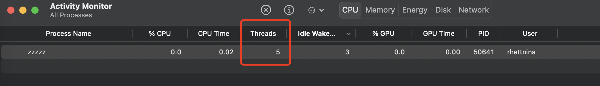

4.1更新

背景：我写的一个程序flora-gopacket-service有时候通过top命令查看时，发现其CPU使用率非常高，需要定位该程序为什么会有如此高的CPU使用率。


## tc命令使用

tc命令的全称是traffic control。

centos的linux上安装用于流量模拟的tc命令：

```shell
yum install iproute-tc
```


> CPU使用率是如何计算的？
>
> **多核**：最开始CPU只有一个核（core），为了提高性能，引入了双核CPU，四核CPU等，双核CPU能同时执行两个线程。
>
>  **超线程技术**：这是针对CPU的核来说的。单个采用超线程的CPU对于操作系统来说就像有两个逻辑CPU。虽然采用超线程技术能同时执行两个线程，但它并不像两个真正的CPU那样，每个CPU都具有独立的资源。当两个线程都同时需要某一个资源时，其中一个要暂时停止，并让出资源，直到这些资源闲置后才能继续。因此超线程的性能并不等于两颗CPU的性能。
>
> 某个进程的CPU使用率就是这个进程在一段时间内占用的CPU时间占总的CPU时间的百分比。
>
> 比如某个开启多线程的进程1s内占用了CPU0 0.6s, CPU1 0.9s, 那么它的占用率是150%。这样就不难理解上例中cputest进程CPU占用率为800%这个结果了。


上图显示主板上有1个插槽（socket），这个插槽插着一个CPU，这个CPU有4个核（core），每个核都使用超线程技术，所以这台机器总共有8个逻辑核。

那么对于golang的`runtime.GOMAXPROCS(1)`函数，其作用是什么呢？

GOMAXPROCS函数用于设置程序中可同时执行的操作系统线程的最大数量。如果你将 `runtime.GOMAXPROCS(4)` 设置为 4，那么程序就可以在 4 个操作系统线程上并行执行 goroutine。

示范：

```go
func main() {
	runtime.GOMAXPROCS(1)
	num := 3
	for i := 0; i < num; i++ {
		tmp := i
		go func() {
			fmt.Println(".......go func.....", tmp)
			for {
				time.Sleep(time.Second)
				fmt.Println("..........", tmp)
			}
		}()
	}
	time.Sleep(time.Second * 10)
}
```

我运行这个程序后输出是：

```shell
.......go func..... 2
.......go func..... 0
.......go func..... 1
.......... 1
.......... 2
.......... 0
.......... 0
.......... 1
.......... 2
```

程序中开启了三个 goroutine，它们仍然可以在单个操作系统线程上并发执行。这是因为 Go 语言的并发模型是基于轻量级线程（goroutine）的，并且在单个操作系统线程上可以同时执行多个 goroutine。也就是goroutine和操作系统的线程其实是两个概念。



但是上面的程序运行后在macOS的Activity Monitor中显示的Threads值是5，为什么？？？


在 macOS 的 Activity Monitor 中，Threads 列显示的是每个进程（或应用程序）当前活跃的线程数量。线程是程序中执行代码的最小单元，它可以独立执行程序的一部分代码。线程的存在使得程序能够同时执行多个任务或处理多个事件。


> ps -T -p 12345 