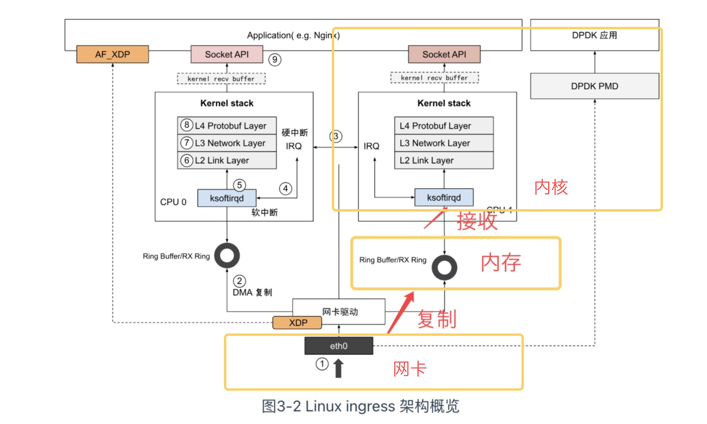

参考文章 https://www.thebyte.com.cn/



Netfilter 实际上就是一个过滤器框架，Netfilter 在网络包收发以及路由的“管道”中，一共切了 5 个口（hook），分别是 PREROUTING、FORWARD、POSTROUTING、INPUT 以及 OUTPUT，其它内核模块(例如 iptables、IPVS 等)可以向这些 hook 点注册处理函数。每当有数据包留到网络层，就会自动触发内核模块注册在这里的回调函数，这样程序代码就能够通过回调函数来干预 Linux 的网络通信，进而实现对数据包过滤、修改、SNAT/DNAT 等各类功能。

> - **PREROUTING:** 接收到的包进入协议栈后立即触发此链，在进行任何路由判断（将包发往哪里）之前。
> - **INPUT:** 接收到的包经过路由判断，如果目的是本机，将触发此链。
> - **FORWARD** 接收到的包经过路由判断，如果目的是其他机器，将触发此链。
> - **OUTPUT:** 本机产生的准备发送的包，在进入协议栈后立即触发此链。
> - **POSTROUTING:** 本机产生的准备发送的包或者转发的包，在经过路由判断之后，将触发此链。

Linux 网络协议栈的处理是一套相对固定和封闭的流程，整套处理过程中，除了网络设备层能看到一点点程序以设备的形式介入处理的空间外，其他过程似乎就没有什么可提供程序插手的空间了。然而事实并非如此，

从 Linux 内核 2.4 版本起，内核就开放了一套通用的，可提供代码干预数据在协议栈流转的过滤框架 -- Netfilter。


iptables通常是系统自带的防火墙，


支持RSS的网卡数据并行能力的优化：

如果在多核 CPU 的服务器上，网卡内部会有多个 Ring Buffer，网卡负责将传进来的数据分配给不同的 Ring Buffer，同时触发的中断也可以分配到多个 CPU 上处理，这样存在多个 Ring Buffer 的情况下 Ring Buffer 缓存的数据也同时被多个 CPU 处理，就能提高数据的并行处理能力。

要实现“网卡负责将传进来的数据分配给不同的 Ring Buffer”，网卡必须支持 Receive Side Scaling(RSS) 或者叫做 multiqueue 的功能。

查看网卡是否支持RSS：

```shell
ethtool -k  eth0|grep receive-hashing
receive-hashing: off [fixed]
```

这是我的输出结果。 `off` 表示接收哈希功能被禁用，而 `[fixed]` 表示该参数是固定的，无法通过修改网卡的配置来改变。

如果支持，可以参考[链接](https://www.thebyte.com.cn/network/RSS.html#_2-2-%E9%98%9F%E5%88%97%E5%A4%A7%E5%B0%8F%E8%B0%83%E6%95%B4)进行RSS的多队列调整和队列大小调整。


由于 TCP 双全工的特性，安全关闭一个连接需要四次挥手，如图 3-17 所示。但复杂的网络环境中存在很多异常情况，异常断开连接会导致产生“孤儿连”，**这种连接既不能发送数据，也无法接收数据，累计过多，会消耗大量系统资源，资源不足时产生 Address already in use: connect 类似的错误。**

也可以调整一些和TCP握手挥手相关的配置，参考[文章](https://www.thebyte.com.cn/network/netstack-performance.html)


高并发下网络协议栈的冗长流程是最主要的性能负担，也就是说**内核才是高并发的瓶颈所在。**


