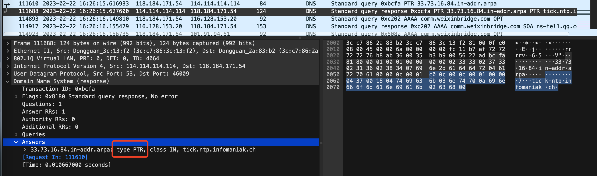
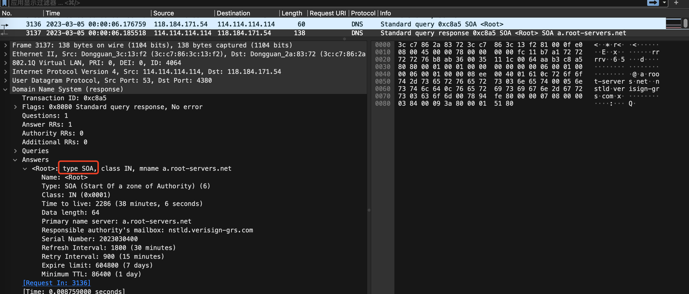
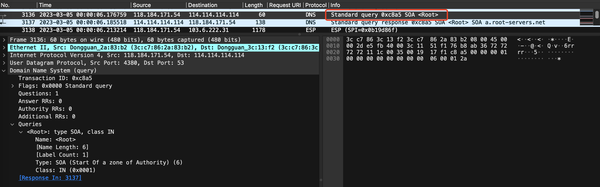
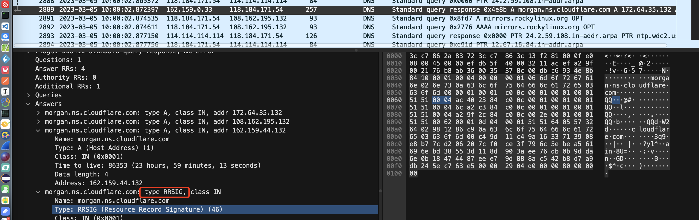
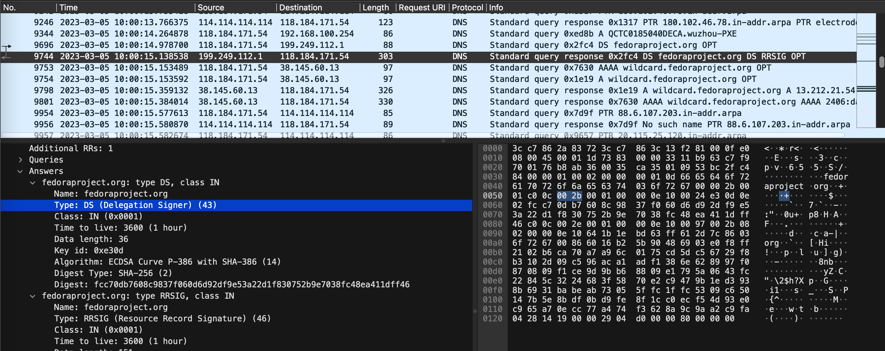
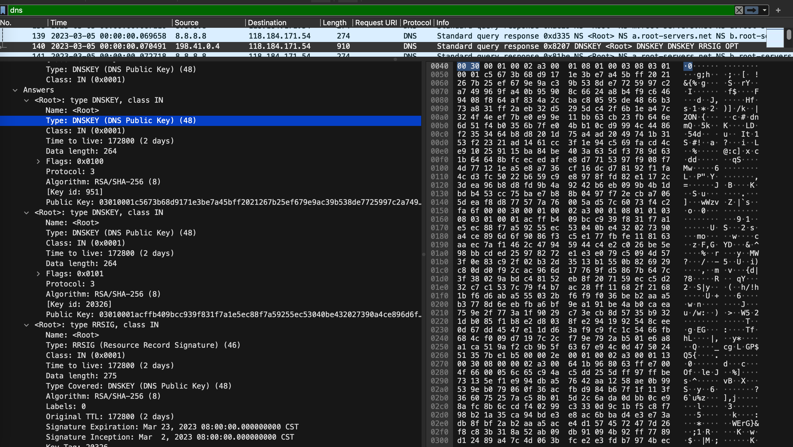
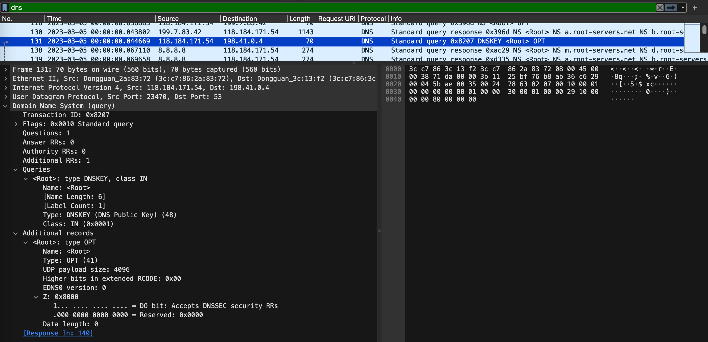
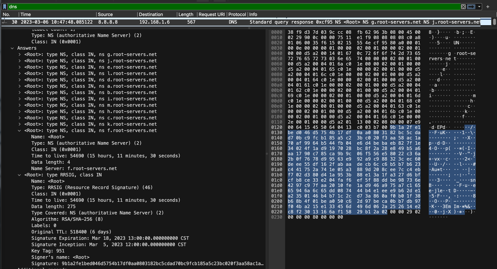
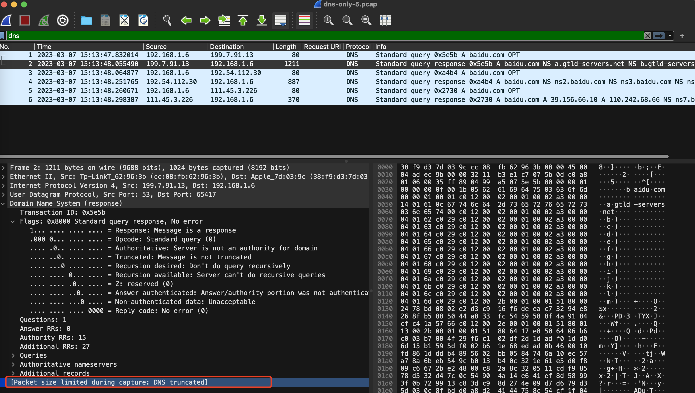

> 开启混杂模式的网卡可以捕获所有流过该网卡的帧，不开启则只能捕获广播帧以及发给该网卡的帧。

## 报文格式


## 乱七八糟的整理

这个章节参考了 http://c.biancheng.net/view/6457.html


数据包在DNS之后还有2段数据，分别是以太网的Trailer和以太网帧校验序列（FCS）。


Authority RRs  权威名称服务器计数：权威名称服务器的数目。
Additional RRs  附加资源记录数：额外的记录数目（权威名称服务器对应 IP 地址的数目）。

### Answers

> Answers 部分的响应数据是根据查询所请求的 DNS 记录类型和查询类型（递归查询或迭代查询）而返回的。如果没有找到匹配的记录，则响应的 Answers 部分将为空。

Answers在有的Response里可能为空，Answers里可能的Type的值我抓包时看到了以下几种（通过gopacket分析的）：

NS、A、CNAME、PTR、AAAA、SOA、Unknown





SOA对应的请求为



还有抓包抓到了一些gopacket里没有定义的类型，比如RRSIG，其对应的值为46

> DNS RRSIG (Resource Record Signature) 是一种 DNS 记录类型，用于提供 DNSSEC (DNS Security Extensions) 安全扩展的数字签名。RRSIG 记录对指定的 DNS 记录进行数字签名，并在签名中包含有关签名算法、签名有效期和其他信息。



还有DS类型的，其对应的值为43



此外还有值为48的DNSKEY类型



其对应的请求为：



### Flag

包含了以下这些字段：


**QR**：查询请求时，值为 0；响应时，值为 1。

**Opcode**：操作码。其中，0 表示标准查询；1 表示反向查询；2 表示服务器状态请求。

**AA**（Authoritative）：授权应答，该字段在响应报文中有效。值为 1 时，表示名称服务器是权威服务器；值为 0 时，表示不是**权威服务器**。我执行了一个`dig +trace baidu.com`请求，只有最后一个响应中的这个AA为1，如下。其他的都是0，为1表示这是一个权威服务器，这个服务器返回了baidu.com的IP。

> 什么叫权威服务器？？？
>
> 在DNS中，权威服务器（Authoritative Server）是指能够对某个域名或主机名提供官方答案的DNS服务器。权威服务器通常是负责管理域名解析信息的DNS服务器，**它们保存有该域名下所有主机的IP地址等DNS记录，可以直接回答该域名下主机的DNS查询请求。**而非权威服务器则是指没有权威性的DNS服务器，它们通常只是缓存了其他服务器的DNS查询结果，以提高DNS查询效率。


这个响应返回的baidu.com的IP在Answers里，展开如下：


这里解析出来的2个IP和我执行 nslookup解析出来的结果是一样的：

```shell
nslookup baidu.com                
Server:		10.50.4.107
Address:	10.50.4.107#53

Non-authoritative answer:
Name:	baidu.com
Address: 39.156.66.10
Name:	baidu.com
Address: 110.242.68.66
```

**TC**

**RD**（Recursion Desired）：是否期望递归，值为1和为0分别表示递归查询和迭代查询。

值为1的情况


对应的响应为


值为0的情况

这里执行`dig +trace baidu.com`，4个请求的RD都是0，请求方192.168.1.5进行了迭代查询。


**递归查询和迭代查询**

**递归查询是默认方式**，迭代查询是以DNS客户端，也就是客户机器为中心查询。其实DNS客户端和本地名称服务器是递归，而本地名称服务器和其他名称服务器之间是迭代。

递归查询：当客户端向本地DNS服务器（可以通过系统设置查看或者 scutil --dns命令查看，比如我电脑的是8.8.8.8）发出查询请求时，如果本地DNS服务器发现没有命中自己的缓存，就会代替客户端查询，直到从权威服务器处得到了正确的解析结果，然后本地DNS服务器就告诉DNS客户端查询的结果。整个过程客户端只需要发出一次请求，也就是向本地DNS服务器发出的那次请求。本地DNS就像一个中介一样。

迭代查询：**客户端**向**本地DNS服务器**发出查询请求时，如果本地DNS服务器发现没有命中自己的缓存，本地DNS就会向**根域名服务器**发出请求，根域名服务器把请求中的DNS域名中的顶级域名对应的**顶级域名服务器**信息返回，本地DNS服务器会将返回的结果返回给客户端。客户端再向本地DNS服务器发出向顶级域名服务器的查询请求，顶级名称服务器在收到DNS查询请求后，也是先查询自己的缓存，如果有所请求的DNS域名的记录项，则相接把对应的记录项返回给本地域名服务器，然后再由本地域名服务器返回给DNS客户端，否则向本地名称服务器返回所请求的DNS域名中的二级域名所对应的二级名称服务器地址。以此类推，直到访问到**权威域名服务器**，权威域名服务器返回请求的域名对应的IP地址。整个过程本地DNS服务器就只是一个单纯的传输和转发作用，不会像递归查询一样主动查询最终结果，真正的驱动还是客户端。

**RA**：只有响应报文可能设置该字段。值为1时表示服务器支持递归查询。

**Z**：保留字段，值必须为0

**rcode**：响应的差错状态，0表示没有错误，非0表示出错了

## 附加资源字段

DNS报文中的附加信息Additional records字段包含了一些额外的记录，这些记录与查询结果相关但不是直接回答查询问题的。它们提供了关于所查询域名的更多信息，例如权威域名服务器的IP地址、域名服务器的版本信息、以及与所查询域名相关的其他域名。

在DNS查询中，附加记录可以帮助客户端更快地获取所需的信息，而不必进行额外的DNS查询。例如，当客户端需要连接某个Web服务器时，Web服务器通常会在DNS响应中返回其IP地址以及网站运行的操作系统版本等信息，客户端可以将这些信息缓存下来，以便更快地建立连接。

## DNS类型

**我总结了下**：每台DNS服务器可以理解为一个表，表存储了一行行信息，每行信息可能是 域名- DNS类型- IP，或者是域名- DNS类型-域名。

这个类型在DNS请求和响应中都会出现：

常见的有以下这些，还有部分未统计：

- NS记录：NS记录是一个指针记录，它指向一组该域名授权的域名服务器的名称。当客户端要查询该域名下的某个主机的IP地址时，需要先向授权域名服务器查询，因此NS记录在DNS解析过程中非常重要。
- A记录：A记录是最基本的DNS记录类型，是Address Record的缩写，它将域名解析为IPv4地址。例如，将www.example.com解析为192.0.2.1。
- AAAA记录：和A记录类似，但是它将域名解析为IPv6地址
- CNAME：将一个别名解析为实际的主机名。
- MX记录（Mail Exchange Record）：指定邮件交换服务器的地址。
- PTR记录（Pointer Record）：反向解析记录，将IP地址解析为域名。
- SOA记录（Start of Authority Record）：区域文件的授权记录，指定了负责该域的DNS服务器。
- SRV记录（Service Record）：指定提供特定服务的服务器的地址。
- TXT记录（Text Record）：包含任意文本信息的记录。

在DNS报文中，NS记录和A记录都可以作为Answer Section的一部分返回给客户端。

### CNAME类型

应当读作：

CNAME记录用于将一个[域名](https://zh.wikipedia.org/wiki/域名)（同名）映射到另一个域名（真实名称），[域名解析服务器](https://zh.wikipedia.org/wiki/域名解析服务器)遇到CNAME记录会以映射到的目标重新开始查询。

比如某个CNAME记录为

```
bar.example.com.        CNAME  foo.example.com.
```

这里*bar.example.com*的“CNAME”是*foo.example.com*，因为CNAME的意思是真实名称，而右侧才是真实名称，才是CNAME。

应当读作：

*bar.example.com*的真实名称是*foo.example.com*。请求访问*bar.example.com*的客户端会得到*foo.example.com*返回的结果。

这是一个方便理解的例子：若要同时运行[文件传输](https://zh.wikipedia.org/wiki/文件传输协议)服务和[Web服务](https://zh.wikipedia.org/wiki/Web服务)，则可以把*ftp.example.com*和*www.example.com*都指向DNS记录*example.com*，而后者则有一个指向IP地址的A记录。如此一来，若服务器IP地址改变，则只需修改*example.com*的A记录即可。那么当发起ftp.example.com的DNS解析时，DNS响应中会包含CNAME记录，请求方会重启查询，查询example.com的对应记录

查询名：一般为要查询的域名，有时也会是 IP 地址，用于反向查询。

## CLASS字段

有以下这些可能值

IN（Internet类）

CS（CSNET类）、CH（CHAOS类）、HS（Hesiod）很少使用

## dig trace命令

> dig（域信息搜索器）是一个在Linux和Unix系统中常用的网络工具，用于查询DNS域名解析相关信息，比如查询域名对应的IP地址、查询DNS服务器的相关信息、查询DNS记录等等。
>
> 它可以通过指定参数和选项进行各种类型的DNS查询，包括常用的A记录、MX记录、CNAME记录等等，还可以设置查询的DNS服务器，以及查询的超时时间等等。同时，dig也可以用于诊断DNS相关的问题，比如检查DNS服务器是否正常工作、解析是否正确等等。

执行nslookup xxx.com时，确认本地DNS服务器是否已经缓存了查询结果。如果本地DNS服务器已经缓存了查询结果，就不会再向上级DNS服务器发出请求了。

为了避免缓存影响，下面加上+trace参数。

> 使用 `dig +trace` 命令会追踪域名解析过程并输出每个步骤的详细信息。**它不会使用DNS缓存，它会从根域名服务器开始，**递归地查询每个级别的 DNS 服务器，直到找到目标域名的 IP 地址或遇到错误。该命令对于诊断 DNS 解析问题非常有用，可以帮助确定哪个服务器出现了问题或哪个环节出现了延迟。

这是执行 ` dig +trace qwewq.com`抓到的包，首先访问了192.5.5.241

> IP地址 192.5.5.241 是由美国国家科学基金会（NSF）资助的互联网核心枢纽机构 VeriSign 公司拥有的一个地址，**是一个根域名服务器**，主要用于管理和运营域名系统（DNS）服务器，其中包括 .com 和 .net 域名的顶级域名服务器。


如果不特意指定+trace只是正常访问，抓到的包结果如下，首先访问了8.8.8.8


这是因为我在电脑的系统设置中配置的DNS地址是8.8.8.8


> 8.8.8.8是Google提供的公共DNS服务器的IP地址。**它不是根域名服务器，而是一个提供DNS解析服务的服务器。**

## 重传的情况

下面的4499和4501都是响应重传包，都是在响应包4497这个响应包发送后重传的


> 为什么wireshark中有的DNS响应显示retransmitted response
>
> Wireshark中显示"retransmitted response"通常表示DNS响应是一个重传的包，即发送方发送了一个DNS响应包，但由于某些原因，接收方没有接收到该包，或者收到的包存在错误或丢失，导致发送方需要重新发送该包。Wireshark通过检查包的序列号和确认号来判断响应是否被重传。当一个响应被重传时，它通常会有一个新的时间戳和序列号，而重传标志位也会被设置。

但是wireshark显示的响应时间还是用第一个返回的响应包计算的，而不是后两个响应包计算的


## 域名体系


**如果本地域名服务器无法对域名进行解析，就首先求助于根域名服务器。**

**权威域名服务器：**这就是前面已经讲过的负责一个区的域名服务器。当一个权限域名服务器还不能给出最后的查询回答时，就会告知发出查询请求的DNS客户，下一步应当找哪一个权威域名服务器。

**各个域的分层上都设有各自的域名服务器，各层域名服务器都了解该层以下分层中所有域名服务器的IP地址。因此它们从根域名服务器开始呈树状结构相互连接。**

一个完整的域名解析过程如下图所示：


## dig +trace抓包详解

我执行了`dig +trace baidu.com`，抓到的包为：


我想知道第一个访问的IP 202.12.27.33 是什么，发现这是一台根域名服务器，目前世界上有13台根域名服务器，这是其中的一台。13台根域名服务器的域名分别是A.ROOT-SERVERS.NET到M.ROOT-SERVERS.NET

可见第一次是随机找了一个根域名服务器访问的。


看看这台根域名服务器返回了什么


可以看到返回了13个.net结尾的域名，分别是a.gtld-servers.net到m.gtld-servers.net，这负责管理 ".com" 顶级域名的13台根域名服务器（也叫一级域名服务器）之一，这里的type是NS，表示请求a.gtld-servers.net这些域名服务器可以获得baidu.com的相关信息。在Additional records还说明了这些顶级域名服务器的IP地址是什么，注意这里的Type是A，表示这些域名对应的IP分别是什么，如m.gtld-servers.net对应的IP是192.55.83.30.

接着随机选了一台g.gtld-servers.net，如数据包202所示，发出请求后获取的响应如下：


ns2.baidu.com这些是存储baidu.com的二级域名服务器，type为NS表示可以访问ns2.baidu.com来获取baidu.com的IP。

接着选择了一台ns3.baidu.com，其IP为36.152.45.193，如数据包208所示，发出请求后获取的响应如下：


可以看到本次终于获取到了Answers。

我发现这几次DNS请求中都有指定OPT，于是了解了一下这个OPT的含义：DNS查询中的OPT是指“Options”（选项）字段，它允许在DNS查询或响应中添加额外的信息，如DNSSEC（DNS安全扩展）相关的信息，以及用于DNS性能、优化和其他目的的标志。


Ps:发现有时在上面的访问根服务器（上面的是 202.12.27.33）的第一步前，会给我本地配置的NDS服务器8.8.8.8发送请求：


可以看出，这是请求根域名服务器的信息的，返回为：

> 补充：返回的flag为0x80a0，因为截图截不到这个信息，所以在这里单独补充



还有Additional Records：


注意这里的Additional Records并没有像我预期的那样给出上面的13个根域名服务器的IP地址，因为其实13个根域名服务器的IP地址通常是固定的，所以没有必要再次返回了。这是DNS协议的规定，也是为了减少网络流量和提高DNS解析效率。这里在13个根域名服务器选择一个，然后DNS客户端本地应该存储了13个根域名服务器对应的IP地址，再找到选择出来的那个根域名服务器对应的IP地址（比如上面的是202.12.27.33），再给这个IP地址发送请求。


## DNS截断例子



这里抓到了一个DNS截断包，使用gopacket获取layers得到的结果是

```
Ethernet IPv4 UDP DecodeFailure
```

具体pcap文件在images/dns-only-5.pcap


参考资料

[CNAME记录-维基百科](https://zh.wikipedia.org/zh-hans/CNAME%E8%AE%B0%E5%BD%95)

[干货分享 | 一文读懂DNS原理及解析过程](https://www.sfn.cn/news/technology/detail/222.html?navId=22)

[DNS报文格式解析（非常详细）](http://c.biancheng.net/view/6457.html)

[DNS解析原理:递归 VS 迭代](https://www.jianshu.com/p/6b502d0f2ede)
